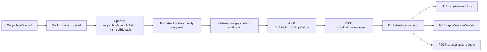

# `xplace-example` Workspace

`xplace-example` is the planned **public publisher reference surface**.

Use this workspace to stage the public-facing publisher example while keeping real production
publisher evolution inside private `xplace`.

## Public Reference Role


Read it as:

- `xplace-example` is the public/reference publisher side
- it is meant to pair with the public tenant and host starter family
- private production `xplace` remains separate

Current rule:

- `xplace` remains the private production publisher surface
- `xplace-example` is the public publisher reference surface
- the two should stay close for now, but should not be treated as the same public/private product

Dependency rule:

- public starter/reference exports should prefer published npm / Packagist packages for shared SDK/runtime surfaces where those packages exist
- for those public exports, prefer the latest published stable versions by default
- the shared publisher core under `apps/publishers/shared/xplace-core` remains curated source inside the repo/export until it is intentionally productized as its own published surface

Near-term intent:

- keep this workspace thin
- reuse the same publisher contract and shared publisher core used by `xplace`
- let branding, docs, sample xapps, and public deployment posture live here

Current deployment rule:

- `xplace-example` is the broader public/example publisher fleet
- it now owns the older pay-by-request and weather reference families that used to live under `xplace`
- it should carry the current example fleet resolved by `scripts/lib/xplace-publisher-xapps.mjs`
- it is the intended publisher side for:
  - `xconecta` when you are exercising the public example/reference lane
  - `xconectb`
  - `xconectc`
  - `xconecta-host`
  - `xconectb-host`
  - `xconectc-host`
- private production `xconect` + `xconect-host` remain paired with private `xplace`
  and the production XMS cert lane `xplace-certs-xms-jsonforms`

Current public-release note:

- the public starter/reference export is now released as `xapps-examples@v0.1.22`
- deploy-time example naming uses:
  - `xconecta-example`
  - `xconecta-example-host`
  - `xconectb-example`
  - `xconectb-example-host`
  - `xconectc-example`
  - `xconectc-example-host`

Current workspace pieces:

- backend shell:
  - [backend/server.js](./backend/server.js)
  - [backend/package.json](./backend/package.json)
  - [backend/.env.example](./backend/.env.example)
- isolated `TASK-044` publisher-rendered certs reference lane:
  - [xapps/xplace-certs-gateway-stripe-publisher-rendered/manifest.json](./xapps/xplace-certs-gateway-stripe-publisher-rendered/manifest.json)
  - [xapps/xplace-certs-gateway-stripe-publisher-rendered/README.md](./xapps/xplace-certs-gateway-stripe-publisher-rendered/README.md)
- isolated publisher-rendered bridge-session reference lane:
  - [xapps/xplace-bridge-session-publisher-rendered/manifest.json](./xapps/xplace-bridge-session-publisher-rendered/manifest.json)
  - [xapps/xplace-bridge-session-publisher-rendered/README.md](./xapps/xplace-bridge-session-publisher-rendered/README.md)
- isolated JSON Forms XMS certificate reference lane:
  - [xapps/xplace-certs-xms-jsonforms/manifest.json](./xapps/xplace-certs-xms-jsonforms/manifest.json)
  - [xapps/xplace-certs-xms-jsonforms/README.md](./xapps/xplace-certs-xms-jsonforms/README.md)
- isolated JSON Forms XMS SmartBill invoice-provider sibling:
  - [xapps/xplace-certs-xms-jsonforms-smartbill/manifest.json](./xapps/xplace-certs-xms-jsonforms-smartbill/manifest.json)
  - [xapps/xplace-certs-xms-jsonforms-smartbill/README.md](./xapps/xplace-certs-xms-jsonforms-smartbill/README.md)
- pay-by-request and weather reference families now owned by `xplace-example`:
  - [xapps/xplace-certs/manifest.json](./xapps/xplace-certs/manifest.json)
  - [xapps/xplace-certs/README.md](./xapps/xplace-certs/README.md)
  - [xapps/xplace-certs-gateway-stripe/manifest.json](./xapps/xplace-certs-gateway-stripe/manifest.json)
  - [xapps/xplace-certs-gateway-stripe/README.md](./xapps/xplace-certs-gateway-stripe/README.md)
  - [xapps/xplace-certs-tenant-delegated-stripe/manifest.json](./xapps/xplace-certs-tenant-delegated-stripe/manifest.json)
  - [xapps/xplace-certs-tenant-delegated-stripe/README.md](./xapps/xplace-certs-tenant-delegated-stripe/README.md)
  - [xapps/xplace-weather-now-gateway-stripe/manifest.json](./xapps/xplace-weather-now-gateway-stripe/manifest.json)
  - [xapps/xplace-weather-now-gateway-stripe/README.md](./xapps/xplace-weather-now-gateway-stripe/README.md)
- isolated JSON Forms XMS virtual-currency certificate reference lane:
  - [xapps/xplace-certs-xms-jsonforms-vc/manifest.json](./xapps/xplace-certs-xms-jsonforms-vc/manifest.json)
  - [xapps/xplace-certs-xms-jsonforms-vc/README.md](./xapps/xplace-certs-xms-jsonforms-vc/README.md)
- isolated publisher-rendered XMS playground:
  - [xapps/xplace-creator-club-publisher-rendered/manifest.json](./xapps/xplace-creator-club-publisher-rendered/manifest.json)
  - [xapps/xplace-creator-club-publisher-rendered/README.md](./xapps/xplace-creator-club-publisher-rendered/README.md)
- isolated BonBun exploratory publisher-rendered lane:
  - [xapps/xplace-bonbun-public-iframe-publisher-rendered/manifest.json](./xapps/xplace-bonbun-public-iframe-publisher-rendered/manifest.json)
  - [xapps/xplace-bonbun-public-iframe-publisher-rendered/README.md](./xapps/xplace-bonbun-public-iframe-publisher-rendered/README.md)
- workspace scripts:
  - [scripts/provision-publisher.mjs](./scripts/provision-publisher.mjs)
  - [scripts/provision-publisher-admin.mjs](./scripts/provision-publisher-admin.mjs)
  - [scripts/prepare-republish-manifests.mjs](./scripts/prepare-republish-manifests.mjs)
- root entrypoints:
  - [scripts/provision/provision-xplace-example-publisher.mjs](../../../scripts/provision/provision-xplace-example-publisher.mjs)
  - [scripts/provision/provision-xplace-example-publisher-admin.mjs](../../../scripts/provision/provision-xplace-example-publisher-admin.mjs)
  - [scripts/prepare/prepare-xplace-example-republish-manifests.mjs](../../../scripts/prepare/prepare-xplace-example-republish-manifests.mjs)
- docs:
  - [docs/README.md](./docs/README.md)
  - [docs/IMPLEMENTATION_MAP.md](./docs/IMPLEMENTATION_MAP.md)

Related references:

- [apps/tenants/docs/README.md](../../tenants/docs/README.md)
- [docs/guides/xconect-xplace/README.md](../../../docs/guides/xconect-xplace/README.md)
- [Public Example Reference Layer Audit](../../../dev/engineering/audits/systems/PUBLIC_EXAMPLE_REFERENCE_LAYER_AUDIT.md)
- [TASK-041](../../../dev/engineering/pm/OPEN_POINTS.md#task-041-public-example--reference-layer-for-tenants-hosts-and-publisher)
- [xplace workspace](../xplace/README.md)
- [Implementation map](./docs/IMPLEMENTATION_MAP.md)

Current operator commands:

```bash
npm run seed:xplace-example-publisher
npm run seed:xplace-example-publisher-admin
npm run xplace-example:prepare-republish -- --json --target-client-slug xconecta
npm run -s xapps -- publish --yes \

Commercial pricing note:

- the shipped XMS/monetization example manifests keep buyer-facing sellable prices explicit
  `gross`
- runtime tax decomposes those payable amounts from the canonical tax policy for invoices
- new catalogs should declare `price_tax_mode` explicitly and should prefer `gross` unless they are
  deliberately tax-exclusive
  --from apps/publishers/xplace-example/xapps/xplace-bridge-session-publisher-rendered/manifest.json \
  --publisher-gateway-url http://localhost:3000 \
  --api-key xplace-example-dev-api-key \
  --replace __TENANT_CLIENT_ID__=<xconecta-client-id> \
  --replace __XPLACE_BACKEND_BASE_URL__=http://localhost:3016
```

Current `TASK-044` lane:

- kept in `xplace-example` as the isolated publisher-rendered certs reference implementation
- uses the real `after:request_created` request-held lifecycle
- current intended example tenant lane: `xconecta`

Current bridge-session lane:

- kept in `xplace-example` as the isolated post-bootstrap publisher-session reference
- current intended Node reference tenant lane: `xconecta`
- proves:
  - verified iframe bootstrap
  - optional signed bootstrap ticket transport for publisher-rendered `iframe_url`
    widgets
  - optional explicit bootstrap-origin allowlist on the publisher backend
  - vendor assertion minting from the host bridge
  - exchange into publisher-local session ownership
  - session inspect/logout routes on the publisher backend

Current BonBun exploratory lane:

- kept in `xplace-example` as the first partner-review iframe lane
- current intended Node reference tenant lane: `xconecta`
- proves only:
  - real public `iframe_url` integration on a partner SPA
  - passive publisher-rendered runtime mode for non-bridge partner review
  - no bootstrap verification yet
  - no linking yet
  - separate publisher clarification brief before we enable those layers
- current local publish:
  - xapp id: `01KN32N19P59CQMCKT21JVCAG2`
  - version id: `01KN33T25APFWGFYNH23N96G38`

Bridge-session flow:



Local dev note:

- `./dev-start.sh` now starts `xplace-example` automatically when `xconectb` or `xconectc` are enabled
- use `START_XPLACE_EXAMPLE=1 ./dev-start.sh` when you want the example publisher shell up explicitly
- local `dev-start` now seeds `xconecta` as a separate tenant on its own example runtime lane
- the canonical local `xplace-example` tenant target is now `xconecta`
- on a clean DB, standalone `xplace-example` local bootstrap can still be redirected explicitly, for example:
  - `XPLACE_EXAMPLE_TENANT_SLUG=xconectb START_XPLACE_EXAMPLE=1 ./dev-start.sh`
- local grouped example publish uses:
  - `npm run publish:xconect-xplace-example`

Default republish behavior:

- `npm run xplace-example:prepare-republish` defaults to the current broader example fleet:
  - `xplace-certs`
  - `xplace-certs-gateway-stripe`
  - `xplace-certs-tenant-delegated-stripe`
  - `xplace-weather-now-gateway-stripe`
  - `xplace-bonbun-public-iframe-publisher-rendered`
  - `xplace-bridge-session-publisher-rendered`
  - `xplace-certs-gateway-stripe-publisher-rendered`
  - `xplace-certs-xms-jsonforms`
  - `xplace-certs-xms-jsonforms-smartbill`
  - `xplace-certs-xms-jsonforms-vc`
  - `xplace-creator-club-publisher-rendered`
  - `xplace-monetization-lab-jsonforms`
- `npm run xplace:prepare-republish` now publishes only the production XMS cert lane
- grouped example-lane publish:

```bash
npm run publish:xconect-xplace-example -- --reference-tenant-profile xconectc
```

Bridge-session runtime note:

- publishing the bridge-session xapp does not require endpoint credentials
- using the bridge exchange at runtime still requires the backend process to have:
  - `XPLACE_EXAMPLE_PUBLISHER_ID`
  - `VENDOR_ASSERTION_SHARED_SECRET`
