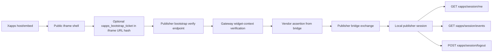

# `xplace-bridge-session-publisher-rendered`

Publisher-rendered reference xapp in `xplace-example` for the post-bootstrap
publisher-local session path.

Purpose:

- keep the current certs payment example untouched
- show the lighter session-ownership flow after verified widget bootstrap
- keep the Node reference target aligned with `xconect`, like the other publisher-rendered lane
- reuse the existing bridge contract:
  - gateway `POST /v1/publisher/bridge/token`
  - publisher `POST /xapps/bridge/exchange`
  - publisher `/xapps/session/*`

Current practical model:

- the iframe asset is still a public/bootstrap shell
- the manifest now opts into the first additive signed bootstrap ticket slice:
  - `config.xapps.bootstrap_transport = "signed_ticket"`
  - wrapper carries `xapps_bootstrap_ticket` in the iframe URL hash
  - `verifyWidgetBootstrap(...)` consumes it and forwards `bootstrapTicket`
- the browser verifies widget runtime through the packaged
  `@xapps-platform/widget-sdk` helper
- the backend verifies runtime through the packaged
  `@xapps-platform/server-sdk` helper
- after verification, the widget requests a vendor assertion from the host bridge
- the widget exchanges that assertion for a publisher-local session
- the widget can then inspect and revoke that local session

Flow:



Current required backend config:

- `VENDOR_ASSERTION_SHARED_SECRET`
- `XPLACE_EXAMPLE_PUBLISHER_ID`
- optional `XPLACE_EXAMPLE_WIDGET_ALLOWED_ORIGINS` for stricter explicit
  bootstrap-origin binding

Publish / install:

```bash
npm run -s xapps -- publish --yes \
  --from apps/publishers/xplace-example/xapps/xplace-bridge-session-publisher-rendered/manifest.json \
  --publisher-gateway-url http://localhost:3000 \
  --api-key xplace-example-dev-api-key \
  --replace __TENANT_CLIENT_ID__=<xconect-client-id> \
  --replace __XPLACE_BACKEND_BASE_URL__=http://localhost:3016
```

Current local publish note:

- the xapp can be published without endpoint credentials because it is widget-only
- the publisher-local session exchange remains unavailable until the running backend
  process actually has the two config values above

This is intentionally a non-linking reference lane. If we later want a full
linking walkthrough in `xplace-example`, it should stay a separate example.
