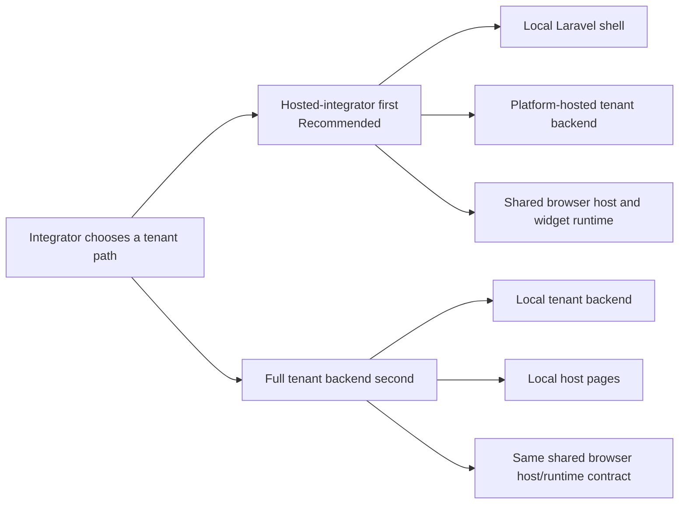
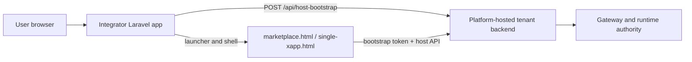
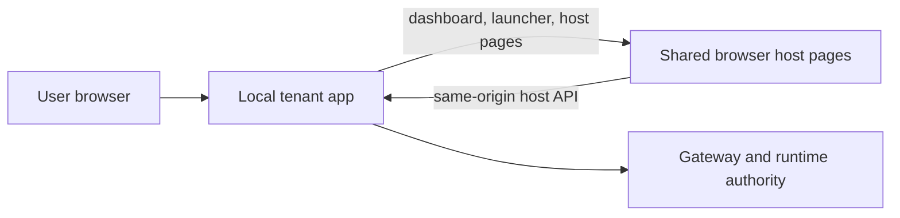

# Tenant Integrator Guide

Use this guide when a tenant integrator wants the shortest path to a working
marketplace backend and host for the public starter/reference family.

This is the shared tenant-facing implementation guide. Use this page for what
the tenant backend and host must actually do, independently of whether the
tenant chooses Node, PHP, or the hosted-integrator browser path.

## Pick Your Starting Shape

For almost every first delivery, choose one of these two paths:

### Path A: Hosted-integrator first

Use this first when the integrator already has a Laravel app and wants the
shortest path to a working marketplace and widget experience.

Read these first:

1. [tooling/laravel-integration-map.md](./tooling/laravel-integration-map.md)
2. [../xconectc-host/README.md](../xconectc-host/README.md)
3. [host/README.md](./host/README.md)

Ownership split:

| Area | Integrator app owns | Platform-owned tenant backend owns |
| --- | --- | --- |
| Shell | launcher, branding, local auth/session, app chrome | none |
| Host contract | local bootstrap proxy only | subject resolution, catalog/widget sessions, bridge routes |
| Runtime authority | none in browser | gateway/session/payment/runtime authority |

### Path B: Full tenant backend second

Use this when the integrator needs to own the tenant backend contract as well.

Read these first:

1. [../xconect/README.md](../xconect/README.md)
2. [backend/README.md](./backend/README.md)
3. [host/README.md](./host/README.md)

Practical rule:

- start with Path A unless you already know you must own the tenant backend
- both paths keep the same shared browser host/runtime contract
- do not rebuild the browser runtime from scratch for either path

## What To Read First

If you only open four pages first, open these:

1. [host-mode/README.md](./host-mode/README.md)
2. [full-mode/README.md](./full-mode/README.md)
3. [common/README.md](./common/README.md)
4. [tooling/laravel-integration-map.md](./tooling/laravel-integration-map.md)

That gives you:

- the host-first adoption path
- the full-backend adoption path
- the shared/common material
- the Laravel shape choice

## Supported Reference Shapes

- same-origin tenant host:
  - [xconect host](../xconect/host/README.md)
  - [xconectb host](../xconectb/host/README.md)
- same-origin launcher-backed tenant app:
  - [xconectc](../xconectc/README.md)
- hosted-integrator frontend with tenant backend still hosted on our side:
  - [host-proof-common](../host-proof-common/README.md)
  - [xconect-host](../xconect-host/README.md)
  - [xconectb-host](../xconectb-host/README.md)
  - [xconectc-host](../xconectc-host/README.md)

## Recommended Integrator Model

The intended adoption order is still:

1. use the shared browser host/runtime
2. keep local code focused on shell, auth, branding, and bootstrap
3. keep the tenant backend on the platform until there is a real need to own it
4. only move to a full tenant backend when the product needs local backend ownership

## What Stays Local

Even when using the backend kit, the tenant still owns:

- startup and env/config mapping
- branding and host pages/assets
- tenant-specific subject-profile catalogs or resolver hooks
- guard manifests and tenant policy choices
- any explicit mode override or custom route behavior

The tenant should not need to reimplement:

- the default host contract
- installation lifecycle routes
- default payment route behavior
- default mode tree
- reference discovery surface

## Folder Map

Use the folder docs by question, not by stack:

- pick the adoption mode first:
  - [host-mode/README.md](./host-mode/README.md)
  - [full-mode/README.md](./full-mode/README.md)
  - [common/README.md](./common/README.md)

- backend contract:
  - [backend/README.md](./backend/README.md)
- host/embed/browser runtime:
  - [host/README.md](./host/README.md)
- publishing and secrets:
  - [publishing/README.md](./publishing/README.md)
- modes/provider boundaries:
  - [modules/README.md](./modules/README.md)
- stack/tooling quickstarts:
  - [tooling/README.md](./tooling/README.md)
- guards and policy ownership:
  - [guards/README.md](./guards/README.md)
- local data seams and subject-profile inputs:
  - [data-seams/README.md](./data-seams/README.md)
- deeper reference-shape comparison:
  - [reference-options/README.md](./reference-options/README.md)

## Recommended Reading Order

1. Choose the adoption mode:
   [host-mode/README.md](./host-mode/README.md)
   or [full-mode/README.md](./full-mode/README.md)
2. Read the shared/common material:
   [common/README.md](./common/README.md)
3. Pick the stack/tooling path:
   [tooling/README.md](./tooling/README.md)
4. Only if you need deeper ownership tradeoffs:
   [reference-options/README.md](./reference-options/README.md)

## Reference Grouping

Treat the tenant references by role first:

- Node starter/reference tenant:
  - [xconect](../xconect/README.md)
- vanilla PHP starter:
  - [xconectb](../xconectb/README.md)
- Laravel starter:
  - [xconectc](../xconectc/README.md)
- host-only references:
  - [xconect-host](../xconect-host/README.md)
  - [xconectb-host](../xconectb-host/README.md)
  - [xconectc-host](../xconectc-host/README.md)
- shared host support:
  - [host-proof-common](../host-proof-common/README.md)

Practical rule:

- `xconect` stays the canonical Node starter/reference tenant
- the first production tenant lane can still use `xconect`
- what remains private there is the production deploy/runtime posture around it, not the existence of `xconect` itself
- the public `xapps-examples` repo keeps these canonical app names
- use `-example` only in example-lane deploy domains/hostnames

## Current Scope

For the current lane:

- `xconect` is the Node reference tenant
- `xconectb` proves the same backend contract on PHP
- `xconectc` is the Laravel full-tenant reference
- `xconectc-host` is the Laravel hosted-integrator reference
- `xplace-example` is the public reference publisher surface
- the tenant backend must expose the secure gateway-facing seams used by the host
- the browser host should stay unprivileged

The first-release recommendation remains:

- browser host: shared runtime
- payments: Stripe, `gateway_managed`
- installation lifecycle: included
- invoicing: platform-managed
- notifications: platform-managed
- subject profiles: optional unless the tenant already has real data to supply

## Session Rule Of Thumb

For integrators, the current session model should be read in two layers:

- widget session:
  - short-lived widget token minted by the tenant/backend contract
  - renewed in place through the shared host/session bridge
- bootstrap session:
  - short-lived browser bootstrap token used for host/session routes
  - renewed through silent re-bootstrap on the current starter/reference host paths

Practical meaning:

- do not treat `subjectId` alone as durable browser proof
- keep raw API keys and signing secrets server-side
- let the shared host/runtime handle widget renewal
- let the local launcher/bootstrap seam handle bootstrap renewal

Use these pages next when session behavior matters:

- [docs/host/README.md](./host/README.md)
- [docs/backend/README.md](./backend/README.md)

## Locale Rule Of Thumb

The first platform i18n wave is aimed at the shipped shared surfaces:

- portal
- marketplace/embed UI
- widget-facing platform copy
- shared guard/remediation copy

Integrator hosts do not need a fully translated shell in that first wave.

They do need:

- one clear locale input into the shared browser-host/runtime path
- a way to test widget/embed behavior in another locale
- the ability to let shared packages own locale propagation instead of building a custom translation bridge

Reference planning note:

- [I18N_SYSTEM_AUDIT.md](../../../dev/engineering/audits/systems/I18N_SYSTEM_AUDIT.md)
