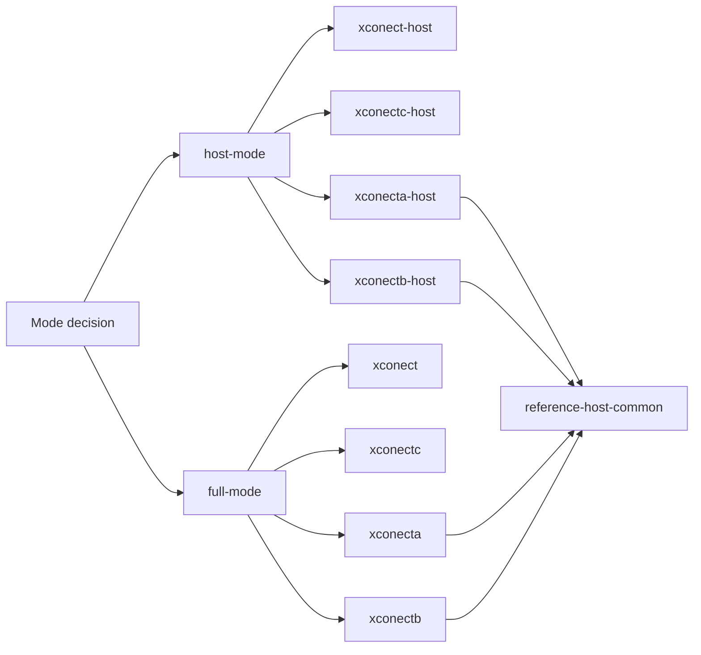

# Tenant Integrator Guide

This is the entrypoint for tenant integration docs.

## 1) Choose Mode First

- hosted-integrator first:
  - [host-mode/README.md](./host-mode/README.md)
- tenant-owned backend second:
  - [full-mode/README.md](./full-mode/README.md)

For the current hosted-integrator onboarding path, subject profiles are
mandatory for the first hosted-integrator tenant lane.

## Mode + Topology Map

## 2) Use Contract Docs (Shared Across Modes)

- host surface contract:
  - [host/README.md](./host/README.md)
- backend contract:
  - [backend/README.md](./backend/README.md)

These two pages now include the protocol diagrams:

- host bootstrap/session sequence:
  - [host/README.md](./host/README.md)
- backend route-family contract flow:
  - [backend/README.md](./backend/README.md)

## 3) Then Open Capability/Ownership Maps

- module/capability matrix:
  - [modules/README.md](./modules/README.md)
- integration consequences:
  - [integrations/README.md](./integrations/README.md)
- shared concerns:
  - [common/README.md](./common/README.md)

## Implementation Topology (Current)

Tenant backend/protocol anchors:

- [xconect](../xconect/README.md)
- [xconectc](../xconectc/README.md)

Reference-driven tenant variants:

- [xconecta](../xconecta/README.md)
- [xconectb](../xconectb/README.md)

Hosted-integrator shells:

- self-contained:
  - [xconect-host](../xconect-host/README.md)
  - [xconectc-host](../xconectc-host/README.md)
- reference-layer based:
  - [xconecta-host](../xconecta-host/README.md)
  - [xconectb-host](../xconectb-host/README.md)

Shared repo reference layer:

- [reference-host-common](../reference-host-common/README.md)

## Practical Rule

- do mode selection once (`host-mode` vs `full-mode`)
- keep host rules in `host/README`
- keep backend rules in `backend/README`
- avoid repeating topology details in every page

## Suggested Reading Order (Complete Pass)

1. [host-mode/README.md](./host-mode/README.md) or [full-mode/README.md](./full-mode/README.md)
2. [integrations/README.md](./integrations/README.md)
3. [host/README.md](./host/README.md)
4. [backend/README.md](./backend/README.md)
5. [modules/README.md](./modules/README.md)
