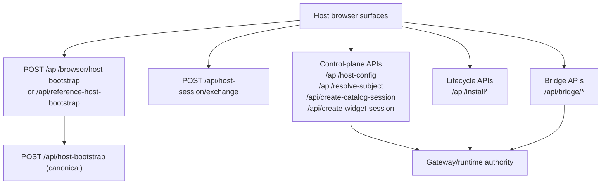

# Tenant Backend Contract

This page explains the tenant backend surface an integrator should expose for
the current marketplace lane.

Choose the adoption mode first:

- [host-mode](../host-mode/README.md)
- [full-mode](../full-mode/README.md)
- [common](../common/README.md)

Use this page as the backend contract reference after that choice, not as a
second landing page.

If you only read one backend page first, read
[../xconect/backend/routes/README.md](../../xconect/backend/routes/README.md).

The PHP reference tenant under
[../xconectb/backend](../../xconectb/backend/README.md)
should mirror this same contract, not define a second tenant API.

Laravel full-tenant reference:

- [../../../apps/tenants/xconectc/README.md](../../xconectc/README.md)

Hosted-integrator Laravel reference:

- [../../../apps/tenants/xconectc-host/README.md](../../xconectc-host/README.md)

Practical mode rule:

- in `host-mode`, the tenant backend may stay platform-hosted while still
  exposing this contract
- in `full-mode`, the integrator owns this contract directly

## Start With The Backend Kit

Use the backend kit first:

- Node:
  - `@xapps-platform/backend-kit`
- PHP:
  - `packages/xapps-backend-kit-php/src/functions.php`

Use primitive SDKs only when you need a deeper override seam:

- Node:
  - <https://github.com/0x730/xapps-sdk-js/tree/main/packages/server-sdk#readme>
- PHP:
  - <https://github.com/0x730/xapps-sdk-php/tree/main/packages/xapps-php#readme>

Package `src/...` links below are source anchors for maintainers and reviewers,
not the preferred consumer surface.

## What The Kit Already Gives You

The backend kit now owns the default backend behavior for:

- health and reference routes
- host config / subject resolution / catalog session / widget session
- installation lifecycle
- bridge routes
- guard request seam
- default payment routes
- default subject-profile route
- default mode tree

Local tenant code should mainly provide:

- config and env mapping
- branding and host pages/assets
- subject-profile catalogs or resolver hooks
- optional route or mode overrides

In Laravel, that local layer can also include:

- dashboard/auth/business pages on the same app origin
- a same-origin launcher that resolves identity before handing off to shared
  host pages
- thin controllers that serve shared host assets or local launcher endpoints

## Recommended Local Tenant Structure

Keep the local backend small and predictable.

Recommended shape:

```text
backend/
  server.js|bootstrap.php
  lib/
    config.*
    appSurfaceModule.*
    subjectProfiles/
      defaultProfiles.*
  routes/
    host/
      pages.*
      shared.*
    README.md
  modes/
    index.js            # Node only when mode enablement normalization is local
    */README.md         # explicit mode docs / override notes
  public/
    tenant-branding-assets...
```

Practical ownership rule:

- package kit owns the default backend behavior
- local backend owns startup, config, branding, host pages, subject-profile data,
  and explicit overrides only

Do not rebuild default gateway routes or default mode implementations locally
unless the tenant really needs a custom seam.

## Override Strategy

Use the simplest override that matches the need.

- config override:
  change kit options for gateway URL, enabled modes, payment settings, reference
  metadata, or branding
- data override:
  replace default subject-profile catalogs or provide a custom resolver hook
- app-surface override:
  customize host pages, assets, and local browser-facing entry files
- runtime override:
  inject a custom host proxy service, gateway client, payment handler, or
  policy resolver only when the default runtime is not enough
- route or mode override:
  last resort; keep it explicit and local

Prefer config and hook seams before replacing route or mode behavior.

## Core Host Contract

This is the mandatory ecosystem integration surface for the tenant browser host.



Required routes:

- `GET /api/host-config`
- `POST /api/resolve-subject`
- `POST /api/create-catalog-session`
- `POST /api/create-widget-session`

Hosted-integrator bootstrap split when the frontend lives on another origin:

- browser-safe local entry: `POST /api/browser/host-bootstrap`
- tenant canonical bootstrap: `POST /api/host-bootstrap`

Same-origin local adapter variants:

- self-contained `xconect` host pages use:
  - `POST /api/browser/host-bootstrap`
- reference-layer variants (`xconecta`, `xconectb`) use:
  - `POST /api/reference-host-bootstrap`
- both have the same responsibility: browser-safe local entry only; no direct
  browser calls to `POST /api/host-bootstrap`

Same-origin launcher note:

- a full tenant app can also expose a local bootstrap route for its own launcher
  page, then hand off to shared host pages on the same origin
- `xconectc` is the current Laravel reference for that pattern

Code anchors:

- [hostApiCore.js](../../../../packages/backend-kit/src/backend/routes/gateway/hostApiCore.ts)
- [hostContractBoundary.js](../../../../packages/backend-kit/src/backend/routes/gateway/hostContractBoundary.ts)

Canonical request shape rule:

- implement the tenant contract in camelCase
- do not add parallel snake_case aliases for the same request fields

## Marketplace Lifecycle

This is part of the required tenant marketplace contract for `xconect`.

Routes:

- `GET /api/installations`
- `POST /api/install`
- `POST /api/update`
- `POST /api/uninstall`

Code anchor:

- [hostApiLifecycle.js](../../../../packages/backend-kit/src/backend/routes/gateway/hostApiLifecycle.ts)

## Advanced Bridge

Add these only when the tenant actually needs them:

- `POST /api/bridge/token-refresh`
- `POST /api/bridge/sign`
- `POST /api/bridge/vendor-assertion`

Code anchor:

- [hostApiBridge.js](../../../../packages/backend-kit/src/backend/routes/gateway/hostApiBridge.ts)

## Session Responsibilities

The backend contract owns two different session layers:

- browser bootstrap session
  - browser-safe local `POST /api/browser/host-bootstrap`
  - server-side tenant `POST /api/host-bootstrap`
  - signs the short-lived browser bootstrap token
  - used by browser-host calls to `/api/host-config`, catalog/widget session minting, lifecycle routes, and bridge routes
- widget session
  - minted through `POST /api/create-widget-session`
  - renewed through `POST /api/bridge/token-refresh`

Current starter/reference expectation:

- widget-session renewal belongs to the shared runtime/bridge path
- bootstrap renewal belongs to the launcher/bootstrap seam
- browser code must never receive raw tenant/gateway API keys

Practical rule:

- backend kit already gives you the default session routes
- local tenant code should only supply config, local launcher/bootstrap surface, and any explicit override

## Gateway Revocation Contract (Execution Plane)

When widget/catalog execution tokens are minted with host-session linkage:

- include `host_session_jti`
- include `host_session_bound: true`
- include `aud_client_id` (must match token `clientId`)

On host-session logout:

- revoke local host-session state first
- then report revocation to gateway (best-effort) so execution-token decoders
  can reject bound tokens globally

Gateway revocation surface:

- `POST /v1/host-sessions/revocations`
- `POST /v1/host-sessions/revocations/bulk`
- `GET /v1/host-sessions/revocations/{hostSessionJti}`

Semantics:

- revocations are isolated by `(client_id, host_session_jti)`
- writes are idempotent and monotonic for `revoked_at`/`exp`

## Other Default Tenant Seams

The default tenant kit also includes:

- guard execution seam:
  - [guard.js](../../../../packages/backend-kit/src/backend/routes/gateway/guard.ts)
- payment routes:
  - [payment.js](../../../../packages/backend-kit/src/backend/routes/gateway/payment.ts)
- subject-profile route:
  - [subjectProfiles.js](../../../../packages/backend-kit/src/backend/routes/gateway/subjectProfiles.ts)
- reference discovery route:
  - [reference.js](../../../../packages/backend-kit/src/backend/routes/reference.ts)

## What Must Stay Tenant-Specific

Keep the tenant backend focused on:

- secure session minting
- tenant-specific signing and policy decisions
- tenant-specific branding and host pages
- tenant-specific subject-profile data or resolver hooks
- explicit mode or route overrides when the tenant really needs them

Do not move browser runtime logic into the backend contract.
Do not rebuild the backend-kit defaults locally unless the tenant truly needs an
override.
