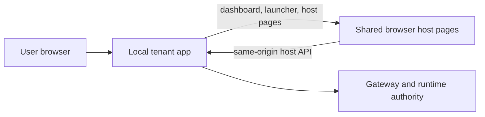

# Full-Mode Integration

Use this path when the integrator wants to own the tenant backend contract as
well as the tenant-facing shell.

This is the second path, after host-mode, not the default first assumption.

## What Full-Mode Means

Read it as:

- the tenant app owns the backend contract
- the tenant app also owns the visible application shell
- shared host pages and shared widget runtime still remain shared

## Start Here

1. [../backend/README.md](../backend/README.md)
2. [../host/README.md](../host/README.md)
3. [../../xconect/README.md](../../xconect/README.md)

Laravel-specific full-mode reference:

- [../../xconectc/README.md](../../xconectc/README.md)

PHP thin backend reference:

- [../../xconectb/README.md](../../xconectb/README.md)

## What To Read Next

- backend contract and kit:
  - [../backend/README.md](../backend/README.md)
- stack/tooling entry points:
  - [../tooling/README.md](../tooling/README.md)
  - [../tooling/nodejs-quickstart.md](../tooling/nodejs-quickstart.md)
  - [../tooling/php-laravel-quickstart.md](../tooling/php-laravel-quickstart.md)
  - [../tooling/laravel-integration-map.md](../tooling/laravel-integration-map.md)
- shared/common concerns:
  - [../common/README.md](../common/README.md)

## Practical Rule

For full-mode:

- start from the backend kit before dropping to primitive SDKs
- keep the browser host/runtime shared
- copy the contract and ownership boundaries, not the exact file layout of
  `xconect`
