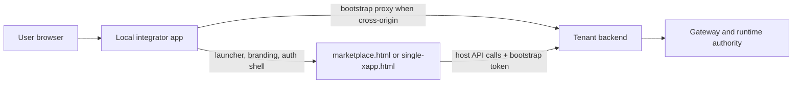

# Host-Mode Integration

Use this path when the integrator wants to keep a local application shell but
does not want to own the tenant backend contract yet.

This is the recommended first delivery path.

## What Host-Mode Means

Read it as:

- the local app owns the visible shell
- the shared host pages and widget runtime stay shared
- the tenant backend still owns subject resolution, sessions, guards, payment,
  and runtime authority

## Choose The Host Shape

### 1. Hosted-integrator host

Use this first when the integrator already has a Laravel, Node, or PHP shell
and wants the fastest route to a working catalog/widget integration.

Start here:

1. [../host/README.md](../host/README.md)
2. [../tooling/laravel-integration-map.md](../tooling/laravel-integration-map.md)
3. [../../xconectc-host/README.md](../../xconectc-host/README.md)

Additional references:

- [../../xconect-host/README.md](../../xconect-host/README.md)
- [../../xconectb-host/README.md](../../xconectb-host/README.md)
- [../../host-proof-common/README.md](../../host-proof-common/README.md)

### 2. Same-origin launcher-backed host

Use this when the tenant app owns the origin and resolves identity first, then
hands off to shared host pages.

Start here:

1. [../host/README.md](../host/README.md)
2. [../../xconectc/README.md](../../xconectc/README.md)

### 3. Same-origin tenant host

Use this when the tenant app already owns both the visible shell and the tenant
backend contract.

Start here:

1. [../host/README.md](../host/README.md)
2. [../../xconect/README.md](../../xconect/README.md)
3. [../../xconectb/README.md](../../xconectb/README.md)

## What To Read Next

- host/browser contract:
  - [../host/README.md](../host/README.md)
- stack-specific quickstarts:
  - [../tooling/README.md](../tooling/README.md)
  - [../tooling/nodejs-quickstart.md](../tooling/nodejs-quickstart.md)
  - [../tooling/php-laravel-quickstart.md](../tooling/php-laravel-quickstart.md)
  - [../tooling/laravel-integration-map.md](../tooling/laravel-integration-map.md)
- shared/common concerns:
  - [../common/README.md](../common/README.md)

## Practical Rule

For host-mode:

- keep local code focused on shell, branding, auth, and bootstrap
- keep shared runtime behavior in `@xapps-platform/browser-host`
- keep widget renewal in shared runtime packages
- keep bootstrap renewal in the local launcher/bootstrap seam
