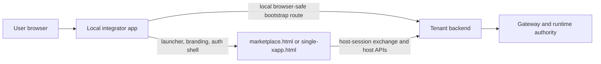

# Host-Mode Integration

Use this path when the integrator wants to keep a local application shell but
does not want to own the tenant backend contract yet.

This is the recommended first delivery path.

## What Host-Mode Means

Read it as:

- the local app owns the visible shell
- the tenant backend remains runtime authority
- browser host contract still follows
  [host/README.md](../host/README.md)

## Choose The Host Shape

### 1. Hosted-integrator host

Use this first when the integrator already has a Laravel, Node, or PHP shell
and wants the fastest route to a working catalog/widget integration.

Start here:

1. [../tooling/first-hosted-tenant-integrator-handoff.md](../tooling/first-hosted-tenant-integrator-handoff.md)
2. [../tooling/hosted-integrator-starter-contract.md](../tooling/hosted-integrator-starter-contract.md)
3. [../tooling/README.md](../tooling/README.md)
4. [../host/README.md](../host/README.md)
5. [../backend/README.md](../backend/README.md)

Additional references:

- [../../xconect-host/README.md](../../xconect-host/README.md)
- [../../xconecta-host/README.md](../../xconecta-host/README.md)
- [../../xconectb-host/README.md](../../xconectb-host/README.md)
- [../../xconectc-host/README.md](../../xconectc-host/README.md)
- [../../reference-host-common/README.md](../../reference-host-common/README.md)

Practical boundary:

- `xconect-host` and `xconectc-host` are now self-contained primary references
- `reference-host-common` is the shared repo reference layer
- `xconecta-host` and `xconectb-host` use that layer
- same-origin tenant side:
  - backend/protocol anchors: `xconect`, `xconectc`
  - self-contained host-page layer: `xconect`, `xconectc`
  - reference-layer host-page variants: `xconecta`, `xconectb`
- it is not the mandatory runtime dependency for host mode
- the mandatory part is the host contract described by backend-kit plus the unified `@xapps-platform/browser-host` surface

### 2. Same-origin launcher-backed tenant host

Use this when the tenant app owns the origin and resolves identity first, then
hands off to host surfaces without splitting frontend/backend ownership.

Start here:

1. [../host/README.md](../host/README.md)
2. [../../xconectc/README.md](../../xconectc/README.md)

## What To Read Next

- host/browser contract:
  - [../host/README.md](../host/README.md)
- backend contract:
  - [../backend/README.md](../backend/README.md)
- stack-specific quickstarts:
  - [../tooling/README.md](../tooling/README.md)
  - [../tooling/nodejs-quickstart.md](../tooling/nodejs-quickstart.md)
  - [../tooling/php-laravel-quickstart.md](../tooling/php-laravel-quickstart.md)
  - [../tooling/laravel-integration-map.md](../tooling/laravel-integration-map.md)
- shared/common concerns:
  - [../common/README.md](../common/README.md)

## Practical Rule

For host-mode:

- keep local code focused on shell, branding, auth, and bootstrap
- keep shared runtime behavior in `@xapps-platform/browser-host`
- keep backend authority in the tenant backend contract
