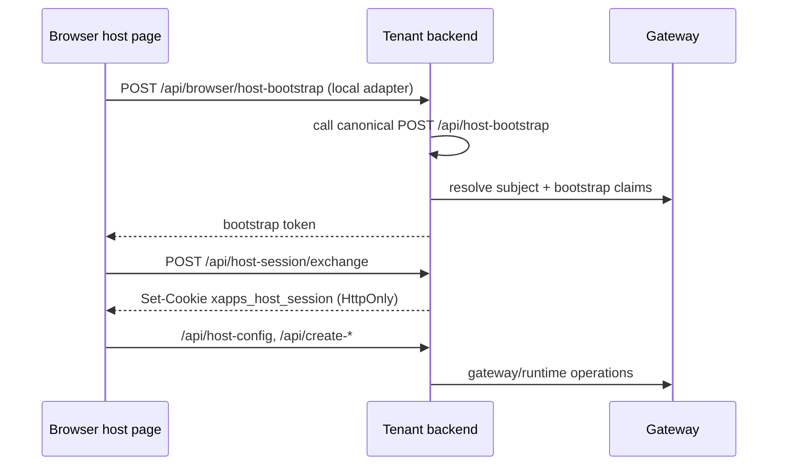

# Host Surface Contract

This page is the shared browser-host contract. It is not the mode decision
page.

Choose mode first:

- [host-mode](../host-mode/README.md)
- [full-mode](../full-mode/README.md)

Then use this page to implement host surfaces correctly.

## What This Document Owns

This page is the source of truth for:

- host surface invariants (`single-panel`, `split-panel`, `single-xapp`)
- bootstrap/session browser contract
- route naming semantics for browser-safe bootstrap adapters
- host-layer ownership boundaries

This page does not own:

- host-mode vs full-mode decision logic
- tenant backend ownership strategy
- stack-specific onboarding and deployment process

## Host Invariants

All tenant host surfaces must share:

- one browser runtime contract (`@xapps-platform/browser-host`)
- one shell interaction model (focus, overlay, expansion)
- one session model (bootstrap entry + host-session exchange)

Allowed variation:

- shell branding and copy
- page layout framing
- initial mount action

Not allowed:

- separate runtime models per page
- page-specific auth/token models
- long-lived browser credentials

## Surface Matrix

| Surface        | Role                                           | Must stay aligned with |
| -------------- | ---------------------------------------------- | ---------------------- |
| `single-panel` | default marketplace entry                      | shared shell/runtime   |
| `split-panel`  | marketplace with dedicated widget pane         | shared shell/runtime   |
| `single-xapp`  | direct one-xapp demo/validation entry          | shared shell/runtime   |

`single-xapp` is not a second host model. It only changes initial mount target.

## Browser Session Model

Two session layers exist and must stay separated:

- bootstrap entry session:
  - short-lived bootstrap token
  - exchanged immediately for host session
- host control-plane session:
  - tenant-issued host session cookie
  - used for `/api/host-config`, session minting, lifecycle, bridge

Widget session remains a separate execution-plane concern.

## Route Naming Rule

Canonical tenant bootstrap is always:

- `POST /api/host-bootstrap` (server-to-server only)

Browser-safe local bootstrap adapter depends on surface:

- hosted-integrator and launcher-backed flows:
  - `POST /api/browser/host-bootstrap`
- same-origin self-contained `xconect` host pages:
  - `POST /api/browser/host-bootstrap`
- same-origin reference-layer variants (`xconecta`, `xconectb`):
  - `POST /api/reference-host-bootstrap`

Both adapter routes are local browser seams. Neither replaces canonical
`POST /api/host-bootstrap`.

## Ownership Boundary

Host layer should own:

- shell, branding, layout
- browser bootstrap handoff
- locale/theme choice and UI state

Host layer should not own:

- gateway credentials
- backend runtime orchestration
- guard/payment business policy

## Current Reference Topology

Same-origin tenant implementations:

- self-contained host/page layer:
  - `xconect`
  - `xconectc`
- reference-layer host/page variants:
  - `xconecta`
  - `xconectb`
  - shared layer: `reference-host-common`

Hosted-integrator implementations:

- self-contained:
  - `xconect-host`
  - `xconectc-host`
- reference-layer based:
  - `xconecta-host`
  - `xconectb-host`
  - shared layer: `reference-host-common`

## Recommended Build Order

1. Implement `single-panel` first.
2. Add `split-panel` only if dedicated widget framing is required.
3. Keep `single-xapp` as a focused demo/validation surface.
4. Keep runtime logic in shared packages.
5. Keep local host code thin and explicit.

## Read Next

- mode decision:
  - [host-mode](../host-mode/README.md)
  - [full-mode](../full-mode/README.md)
- backend contract:
  - [backend/README.md](../backend/README.md)
- hosted-integrator onboarding:
  - [tooling/first-hosted-tenant-integrator-handoff.md](../tooling/first-hosted-tenant-integrator-handoff.md)
- browser package contract:
  - [packages/browser-host/README.md](../../../../packages/browser-host/README.md)
