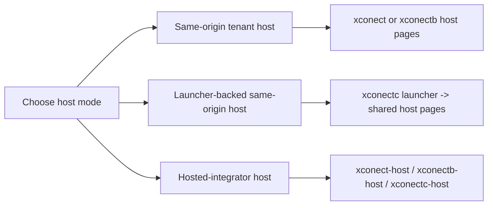
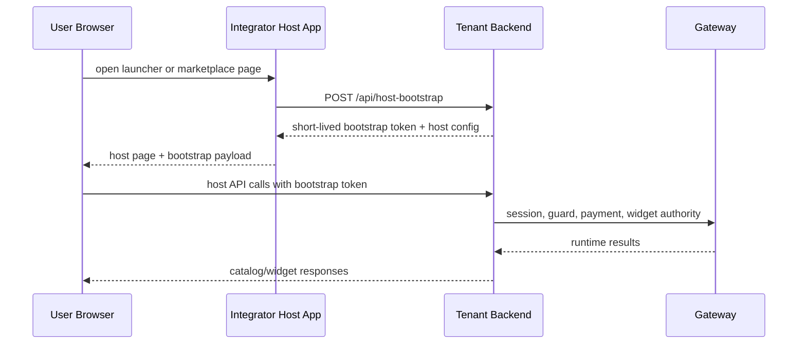
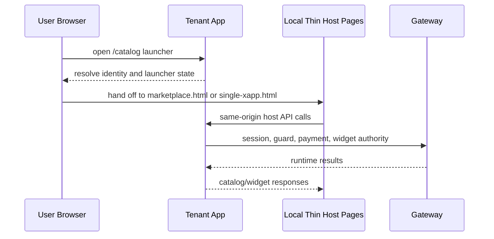

# Tenant Host Integration

This page explains the tenant-owned browser host layer for the current
`xconect` reference lane and the shared host contract used by `xconectb` and
the `xconectc` launcher-backed variant.

If you only read one host file first, read
[../xconect/host/xconect-host-runtime.js](../../xconect/host/xconect-host-runtime.js).

## Host Modes At A Glance

Read it as:

- same-origin host: tenant app owns both shell and backend origin
- launcher-backed host: tenant app resolves identity first, then hands off to
  shared host pages on the same origin
- hosted-integrator host: local app owns the shell, but the tenant backend
  stays on another origin and remains the runtime authority

## What The Host Owns

For the current lane, the host page owns:

- the visible tenant shell and branding
- the runtime backend-truth surface opened from the topbar `Info` action
  - confirms workspace, stack, current-subject installs, and tenant guard family
- the stable subject bootstrap flow
- mounting the shared marketplace runtime
- payment resume preservation in the browser
- local choices like `single-panel`, `split-panel`, or `single-xapp`

The host should not rebuild bridge/runtime orchestration manually.

## Host Invariant

All tenant host surfaces must follow one browser contract:

- one shared host scaffold
- one shared runtime contract
- one shared focus/overlay behavior

Allowed differences between host surfaces are only:

- shell copy and branding
- layout framing
- initial mount action

In the current reference lane, that means:

- `single-panel`
  - mounts the marketplace shell
- `split-panel`
  - mounts the marketplace shell with a dedicated widget pane
- `single-xapp`
  - mounts one xapp inside the same catalog/xapp-shell contract

## Host Surface Matrix

| Surface        | Purpose                                                   | Recommended use                        | Shared contract rule                                     |
| -------------- | --------------------------------------------------------- | -------------------------------------- | -------------------------------------------------------- |
| `single-panel` | full marketplace in one embedded surface                  | default first-release marketplace host | normal marketplace shell + normal focus/overlay behavior |
| `split-panel`  | full marketplace with dedicated widget panel              | when the tenant wants stronger framing | same marketplace shell/runtime, different layout framing |
| `single-xapp`  | direct demo/validation page for one already-deployed xapp | focused demos and validation only      | same marketplace shell/runtime, same focus/overlay       |

`single-xapp` is not a separate overlay model.

It must:

- use the same host shell conventions as marketplace
- use the same `mode-shell -> main-content -> panel -> #catalog` scaffold
- use the same shared expand/focus behavior as the other catalog surfaces
- differ only by the initial action: `mountXapp(xappId)`

Do not add page-local expand/focus rules just for `single-xapp`.

## Implementation Order

1. Start from `@xapps-platform/browser-host` for the standard host path.
2. Keep tenant-specific logic in the shell/bootstrap layer.
3. Use `single-panel` first unless the tenant really wants stronger host framing.
4. Add split-panel behavior only when it is a real product requirement.
5. Use the single-xapp surface only for focused demos or direct xapp validation, not as the main marketplace host.

## Recommended Browser Path

Start from the shared browser host layer and keep the tenant layer thin:

- `@xapps-platform/browser-host`
- `bootstrapXappsEmbedSession(...)`
- `mountCatalogEmbed(...)`
- `mountSingleXappEmbed(...)`

Use the lower-level browser-host helpers or `@xapps-platform/embed-sdk` only
when the tenant truly needs a custom host shape.

## Hosted-Integrator Variant

The same host contract also supports a frontend-on-one-origin / tenant-backend-
on-another-origin shape.

Reference pieces:

- proof/common host scaffold:
  - [../reference-host-common/README.md](../../reference-host-common/README.md)
- Node proof host:
  - [../xconect-host/README.md](../../xconect-host/README.md)
- PHP proof host:
  - [../xconectb-host/README.md](../../xconectb-host/README.md)
- Laravel proof host:
  - [../xconectc-host/README.md](../../xconectc-host/README.md)

Current boundary:

- `xconect-host` and `xconectc-host` are self-contained hosted-integrator references
- `reference-host-common` is the shared repo reference layer for the secondary proof lanes
- `xconect` and `xconectc` are self-contained on the same-origin tenant side

In that mode:

- integrator browser/frontend mounts the unified `@xapps-platform/browser-host` surface
- integrator backend performs the server-to-server bootstrap call
- tenant backend still owns subject resolution, catalog/widget session minting,
  bridge routes, and payment/runtime behavior

### Hosted Bootstrap Flow

Practical meaning:

- the browser never gets raw tenant or gateway credentials
- the bootstrap token is short-lived and browser-safe
- the tenant backend still remains the only runtime authority

## Same-Origin Launcher Variant

The same browser-host package also supports a same-origin tenant launcher that
resolves identity first, stores short-lived bootstrap state locally, and then
hands off to local thin host pages on the same tenant origin.

Reference piece:

- Laravel launcher-backed sample:
  - [../../../apps/tenants/xconectc/README.md](../../xconectc/README.md)

In that mode:

- the tenant app owns the launcher page and local bootstrap POST
- the tenant serves the local thin host pages/assets
- those local pages call `@xapps-platform/browser-host` for the SDK/runtime
- `entryHref` should point back to the launcher instead of `/`
- the backend can stay same-origin, so `host.allowedOrigins` can remain empty
  unless another frontend origin is introduced later

### Launcher-Backed Flow

## Session Lifecycle

The host layer should treat widget renewal and bootstrap renewal as separate concerns.

### Widget session

- the widget runs on a short-lived widget token
- the shared host/runtime renews that token through bridge v2
- terminal failure should surface as host-owned expiry UX, not as a raw iframe `401`

### Bootstrap session

- the browser host runs on a short-lived bootstrap token
- current starter/reference hosts attempt silent re-bootstrap first
- if renewal fails, the host should return the operator to the launcher/entry page

Practical rule:

- keep widget renewal in the shared packages
- keep bootstrap renewal in the local launcher/bootstrap seam
- do not try to make the host page itself own raw API keys or long-lived browser credentials

## Locale Ownership Rule

For the upcoming i18n lane, the host should be treated as the locale owner, not as the place where a second translation system appears.

Practical rule:

- host/app shell chooses the active locale
- shared browser-host/embed/widget packages propagate and consume that locale
- widgets should react to host locale changes through the shared bridge contract
- integrator hosts do not need full translated shells to validate the contract

That keeps locale behavior aligned with the current session/theme ownership model:

- top-level shell owns the choice
- shared packages own propagation and shared UX copy

## Locale Testing Seam

Current starter/reference hosts now expose the same practical locale seam for embed testing:

- a launcher language selector
- a host-header language selector on marketplace and single-xapp pages
- browser-local persistence of the last chosen locale
- direct URL override with `?locale=en` or `?locale=ro`

That applies to:

- `xconect`
- `xconectb`
- `reference-host-common`
- launcher-backed `xconectc`

Practical rule:

- the host chooses locale
- `@xapps-platform/browser-host` passes it into the marketplace/widget runtime
- open widgets receive later changes through `XAPPS_LOCALE_CHANGED`

So integrators can test multilingual embed behavior without building a separate locale bridge around the widget or catalog runtime.

Reference planning note:

- [I18N_SYSTEM_AUDIT.md](../../../../dev/engineering/audits/systems/I18N_SYSTEM_AUDIT.md)

## Read These In Order

- local host overview: [../xconect/host/README.md](../../xconect/host/README.md)
- runtime config: [../xconect/host/xconect-host-runtime.js](../../xconect/host/xconect-host-runtime.js)
- shell/chrome: [../xconect/host/xconect-host-shell.js](../../xconect/host/xconect-host-shell.js)
- tenant config: [../xconect/host/xconect-reference-config.js](../../xconect/host/xconect-reference-config.js)
- repo reference launcher controller: [../reference-host-common/host/reference-launcher-page.js](../../reference-host-common/host/reference-launcher-page.js)
- repo reference marketplace page controller: [../reference-host-common/host/reference-marketplace-page.js](../../reference-host-common/host/reference-marketplace-page.js)
- repo reference single-xapp page controller: [../reference-host-common/host/reference-single-xapp-page.js](../../reference-host-common/host/reference-single-xapp-page.js)
- tenant asset aliases for those controllers: [../xconect/backend/routes/host/shared.js](../../xconect/backend/routes/host/shared.js)
- shared browser-host package: [packages/browser-host/README.md](../../../../packages/browser-host/README.md)
- canonical hosted-integrator handoff: [../tooling/first-hosted-tenant-integrator-handoff.md](../tooling/first-hosted-tenant-integrator-handoff.md)
- hosted-integrator proof/common scaffold: [../reference-host-common/README.md](../../reference-host-common/README.md)
- hosted-integrator proof hosts:
  - [../xconect-host/README.md](../../xconect-host/README.md)
  - [../xconectb-host/README.md](../../xconectb-host/README.md)
  - [../xconectc-host/README.md](../../xconectc-host/README.md)
- same-origin launcher-backed tenant:
  - [../../../apps/tenants/xconectc/README.md](../../xconectc/README.md)

Important boundary:

- `@xapps-platform/browser-host` is the browser SDK
- the repo reference launcher/page controllers live under `apps/tenants/reference-host-common`
- those reference files are not the public SDK contract

Publication rule:

- the public starter/reference family keeps the canonical app names
- `reference-host-common` is the shared repo reference layer for `xconecta-host` and `xconectb-host`
- use `-example` only for deploy hostnames/domains in the example lane

## Current Code Anchors

- [../xconect/host/README.md](../../xconect/host/README.md)
- [../xconect/host/index.html](../../xconect/host/index.html)
- [../xconect/host/marketplace.html](../../xconect/host/marketplace.html)
- [../xconect/host/single-xapp.html](../../xconect/host/single-xapp.html)
- [../xconect/host/xconect-reference-config.js](../../xconect/host/xconect-reference-config.js)
- [../xconect/host/xconect-host-runtime.js](../../xconect/host/xconect-host-runtime.js)
- [../xconect/host/xconect-host-shell.js](../../xconect/host/xconect-host-shell.js)
- [../xconect/backend/routes/host/shared.js](../../xconect/backend/routes/host/shared.js)
- [../reference-host-common/host/reference-launcher-page.js](../../reference-host-common/host/reference-launcher-page.js)
- [../reference-host-common/host/reference-marketplace-page.js](../../reference-host-common/host/reference-marketplace-page.js)
- [../reference-host-common/host/reference-single-xapp-page.js](../../reference-host-common/host/reference-single-xapp-page.js)
  These are repo-owned reference host controllers. They help our tenant/reference
  hosts stay aligned, but integrators should start from the browser SDK surface
  in [packages/browser-host/README.md](../../../../packages/browser-host/README.md).

## Practical Rule

Keep tenant-specific code focused on:

- branding and copy
- truth-telling tenant proof data from `/api/reference`, `/api/host-config`, and `/api/installations`
- identity/bootstrap
- layout choices
- a few local callbacks

Push reusable runtime logic into the shared SDK instead of duplicating it in the page.
Do not turn the tenant host into a second runtime/framework layer.
