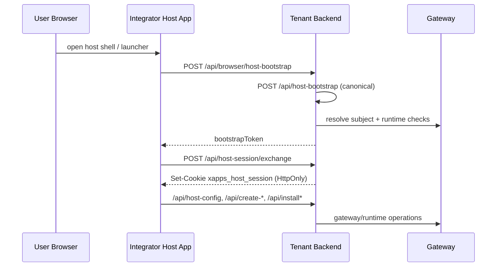
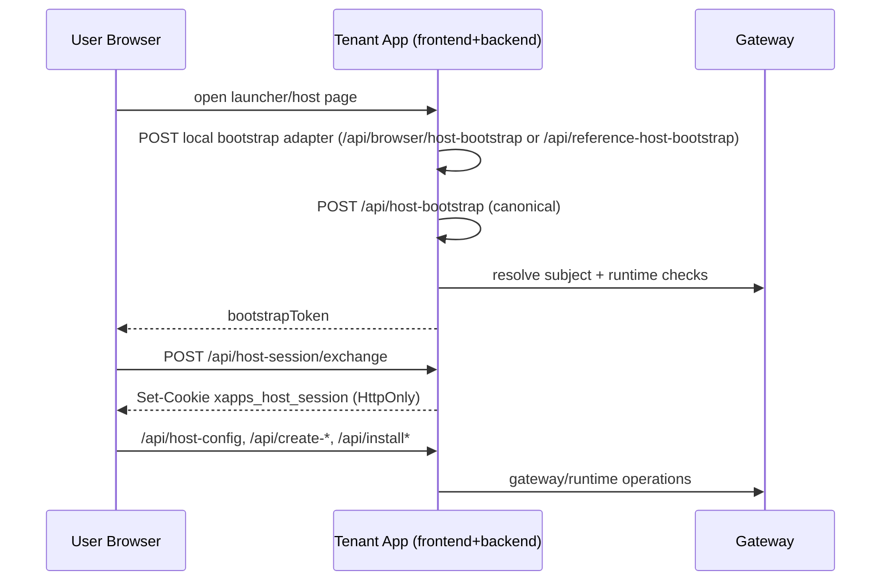

# Tenant Integrations

This page is the quick integration map: mode, flow, and ownership in one place.

Contract details remain in:

- [host/README.md](../host/README.md)
- [backend/README.md](../backend/README.md)
- [modules/README.md](../modules/README.md)

## Fast Path

1. Choose mode:
   - [host-mode](../host-mode/README.md)
   - [full-mode](../full-mode/README.md)
2. Confirm flow (bootstrap + session) in the diagrams below.
3. Implement with backend-kit + browser-host first, then add tenant-specific overrides.

## Mode Flows

### Host-Mode (Hosted Integrator, Cross-Origin)

### Full-Mode (Tenant-Owned, Same-Origin)

## Responsibility Map

| Layer                                        | Responsibility                                                                 | Must not own                            |
| -------------------------------------------- | ------------------------------------------------------------------------------ | --------------------------------------- |
| `@xapps-platform/browser-host`               | browser runtime behavior, host session exchange lifecycle, embed orchestration | tenant business policy, gateway secrets |
| `@xapps-platform/backend-kit`                | tenant backend route contract and secure host-session protocol                 | tenant-specific branding/shell UX       |
| `reference-host-common`                      | shared reference host-page controllers for reference variants                  | canonical contract ownership            |
| tenant backend (`xconect`, `xconectc`, etc.) | env/config mapping, local adapters, tenant policy/data seams                   | browser runtime duplication             |
| tenant/integrator host pages                 | launcher UX, branding, local shell state                                       | direct gateway credential handling      |

## Workspace Topology

| Workspace       | Mode role                       | Host-page layer |
| --------------- | ------------------------------- | --------------- |
| `xconect`       | full-mode tenant (Node)         | self-contained  |
| `xconectc`      | full-mode tenant (Laravel)      | self-contained  |
| `xconecta`      | full-mode tenant variant (Node) | reference-layer |
| `xconectb`      | full-mode tenant variant (PHP)  | reference-layer |
| `xconect-host`  | host-mode shell (Node)          | self-contained  |
| `xconectc-host` | host-mode shell (Laravel)       | self-contained  |
| `xconecta-host` | host-mode shell variant (Node)  | reference-layer |
| `xconectb-host` | host-mode shell variant (PHP)   | reference-layer |

## Route Families

Browser host core:

- `GET /api/host-config`
- `POST /api/resolve-subject`
- `POST /api/create-catalog-session`
- `POST /api/create-widget-session`

Lifecycle:

- `GET /api/installations`
- `POST /api/install`
- `POST /api/update`
- `POST /api/uninstall`

Execution seams:

- `POST /xapps/requests`
- `POST /guard/subject-profiles/tenant-candidates`

Payment seams:

- `/api/tenant-payment/*`
- `/api/payment/return/verify`
