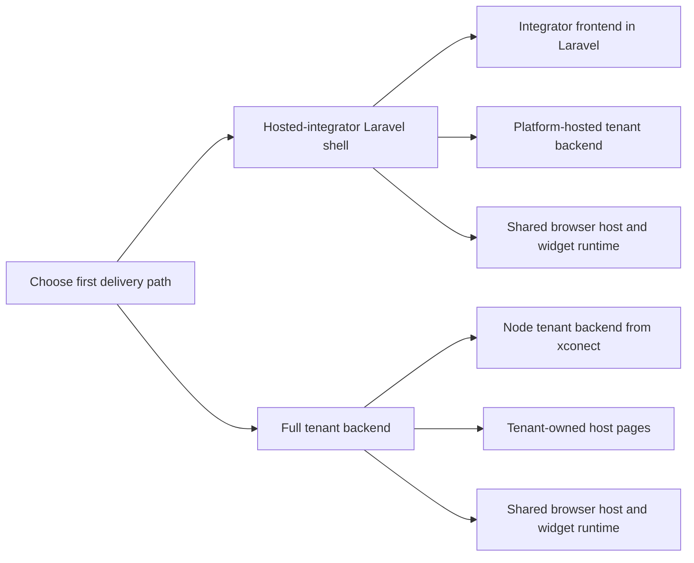

# Tenant Integrations

Use this page when the tenant team needs one practical view of what is
integrated in the current lane and what the tenant actually has to own.

This page is now a shared consequence matrix. Choose the adoption mode first:

- [host-mode](../host-mode/README.md)
- [full-mode](../full-mode/README.md)
- [common](../common/README.md)

## Start Here

Read these first:

1. [../backend/README.md](../backend/README.md)
2. [../modules/README.md](../modules/README.md)
3. [../guards/README.md](../guards/README.md)

## Recommended Path

For the first integrator, the recommended path is now:

- frontend shell:
  - hosted-integrator
  - Laravel app owns the local shell and bootstrap
- tenant backend:
  - platform-hosted tenant backend on the shared contract
- browser runtime:
  - shared browser host/runtime
- payments:
  - Stripe
  - `gateway_managed`

Use this when fast delivery matters more than full tenant-owned backend adoption.

Second path, when the integrator later wants more ownership:

- full tenant backend:
  - Node reference path from `xconect`
- same shared browser host/runtime contract
- same payment/guard/session rules

## Two Practical Starting Shapes

### A. Hosted-integrator first

Use this first when:

- the integrator already has a Laravel app
- they want fast delivery
- we still host and operate the tenant backend
- they only need the browser/embed shell locally

Read these first:

- [../README.md](../README.md)
- [../host/README.md](../host/README.md)
- [../tooling/laravel-integration-map.md](../tooling/laravel-integration-map.md)
- [../../xconectc-host/README.md](../../xconectc-host/README.md)

### B. Full tenant backend second

Use this when:

- the integrator wants the tenant backend under their own app/runtime
- they need more tenant-owned backend seams
- they are ready to operate the backend contract directly

Read these first:

- [../backend/README.md](../backend/README.md)
- [../../xconect/README.md](../../xconect/README.md)
- [../modules/README.md](../modules/README.md)

For the lean marketplace path, keep:

- backend kit provides the default tenant backend
- browser host uses the shared runtime
- Stripe uses `gateway_managed`
- installation lifecycle stays included
- invoicing stays platform-managed
- notifications stay platform-managed
- subject-profile candidates are optional in the generic lean path, but mandatory for the current first hosted-integrator lane

Use expanded ownership only when the tenant already knows it needs:

- delegated payment credentials
- tenant-owned payment page
- ERP/CRM-backed subject profiles
- additional custom backend seams

## Integration Families

### Browser Host

Required backend routes:

- `GET /api/host-config`
- `POST /api/resolve-subject`
- `POST /api/create-catalog-session`
- `POST /api/create-widget-session`

Hosted-integrator bootstrap route when the frontend lives on another origin:

- `POST /api/host-bootstrap`

Code anchor:

- [hostApiCore.js](../../../../packages/backend-kit/src/backend/routes/gateway/hostApiCore.ts)

Reference implementations:

- same-origin host:
  - [xconect host](../../xconect/host/README.md)
  - [xconectb host](../../xconectb/host/README.md)
- same-origin launcher-backed tenant app:
  - [xconectc](../../xconectc/README.md)
- hosted-integrator proof/reference:
  - [xconect-host](../../xconect-host/README.md)
  - [xconectb-host](../../xconectb-host/README.md)
  - [xconectc-host](../../xconectc-host/README.md)
  - [reference-host-common](../../reference-host-common/README.md)
    - shared repo reference layer for `xconecta-host` and `xconectb-host`

### Installation Lifecycle

Required for `xconect` as a real marketplace:

- `GET /api/installations`
- `POST /api/install`
- `POST /api/update`
- `POST /api/uninstall`

Code anchor:

- [hostApiLifecycle.js](../../../../packages/backend-kit/src/backend/routes/gateway/hostApiLifecycle.ts)

### Guard Execution

Current tenant request seam:

- `POST /xapps/requests`

Code anchor:

- [guard.js](../../../../packages/backend-kit/src/backend/routes/gateway/guard.ts)

This is currently a narrow tenant guard and policy execution seam, not a general
tenant request platform.

### Payments

Current tenant payment choices:

- `gateway_managed`
- `tenant_delegated`
- `publisher_delegated`
- `owner_managed`

Current recommendation:

- Stripe
- `gateway_managed`

Code anchors:

- [payment.js](../../../../packages/backend-kit/src/backend/routes/gateway/payment.ts)
- [modes/index.js](../../xconect/backend/modes/index.js)

### Subject Profiles

Current tenant profile seam:

- `POST /guard/subject-profiles/tenant-candidates`

Code anchor:

- [subjectProfiles.js](../../../../packages/backend-kit/src/backend/routes/gateway/subjectProfiles.ts)

## Practical Rule

Keep the tenant-owned surface narrow:

- policy choices stay tenant-owned
- branding and host pages stay tenant-owned
- subject-profile data can be tenant-owned
- gateway/session/runtime infrastructure should stay shared unless the tenant
  truly needs more ownership
