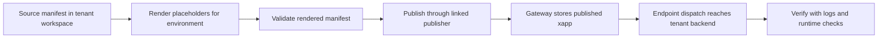

# Tenant Guard Publishing And Secrets

Use this page when the tenant team needs the concrete publishing and secret-management playbook for tenant-owned guards.

This is the place to answer:

- how tenant guards are published today
- how a tenant replaces placeholders before publish
- which secrets/refs belong to which payment mode
- where endpoint credentials fit

CLI operator baseline:

- use the supported tenant/publisher subset in [xapps-cli.md](../../../../docs/packages/xapps-cli.md)
- for tenant-owned guards, the practical operator path is:
  - `xapps validate`
  - `xapps publish`
  - `xapps logs`
  - `xapps publisher endpoint credential ensure`
- treat repo-only CLI helpers as internal engineering tools, not as the tenant publishing contract

## Publishing Flow At A Glance



Read it as:

- source manifests stay templated in the repo
- rendered manifests are deployment artifacts
- the linked publisher publishes the tenant-owned guard
- publish is not enough on its own; endpoint dispatch and runtime verification
  must also succeed

## Start here

Read these first:

1. [../common/README.md](../common/README.md)
2. [../guards/README.md](../guards/README.md)
3. [../integrations/README.md](../integrations/README.md)
4. [../../xapps/README.md](../../xconect/xapps/README.md)

## 1. How publishing works today

Current important rule:

- there are no tenant-native xapp authoring/import routes yet

So tenant-owned guards are currently published through:

- a publisher linked to the tenant
- for example `xconect-policies`

That means:

- source manifests still live in the tenant workspace
- publishing still goes through the standard publisher import/publish contract
- the tenant backend remains the execution target for tenant-owned guard behavior

Code/document anchors:

- [../../xapps/README.md](../../xconect/xapps/README.md)
- [../guards/README.md](../guards/README.md)

## 2. Source of truth

Keep source manifests here:

- [../../xapps/guards](../../xconect/xapps/guards)

Useful sample manifests in the current repo:

- gateway-managed / baseline tenant payment guard:
  - [xconect-tenant-payment-policy/manifest.json](../../xconect/xapps/guards/xconect-tenant-payment-policy/manifest.json)
- tenant-delegated Stripe guard:
  - [xconect-tenant-payment-policy-stripe-delegated/manifest.json](../../xconect/xapps/guards/xconect-tenant-payment-policy-stripe-delegated/manifest.json)
- gateway-executed Stripe guard:
  - [xconect-tenant-payment-policy-stripe-gateway/manifest.json](../../xconect/xapps/guards/xconect-tenant-payment-policy-stripe-gateway/manifest.json)
- subject-profile guard:
  - [xconect-tenant-subject-profile-policy/manifest.json](../../xconect/xapps/guards/xconect-tenant-subject-profile-policy/manifest.json)

Practical rule:

- keep placeholders in source manifests
- do not hardcode environment-specific secrets or runtime URLs into source manifests
- do not fix behavior with manual DB edits

## 3. Provisioning prerequisites

For the current local/reference flow, the tenant/policy publisher setup is seeded through:

```bash
npm run seed:xconect-tenant
npm run seed:xconect-tenant-admin
npm run seed:xconect-policy-publisher
```

Workspace-owned wrapper entrypoints for those commands live under:

- [../../scripts/provision-tenant.mjs](../../xconect/scripts/provision-tenant.mjs)
- [../../scripts/provision-tenant-admin.mjs](../../xconect/scripts/provision-tenant-admin.mjs)
- [../../scripts/provision-policy-publisher.mjs](../../xconect/scripts/provision-policy-publisher.mjs)

What this gives you:

- tenant/client baseline
- tenant admin baseline
- linked publisher baseline for tenant-owned guard publishing

For the real production/shared-ops flow, the practical sequence is:

1. we create the tenant client in the platform
2. we provide the tenant with the relevant API key(s)
3. we agree the tenant backend base URL and host origin
4. the tenant renders placeholders for its environment
5. the guard is published through the real gateway URL
6. the tenant/platform side verifies that dispatch and host flows work against the same client

Important rule:

- local seeding is only the development/reference shortcut
- production onboarding must be described in terms of client creation, API keys, gateway URL, tenant backend URL, and post-publish verification

## 4. Publish flow

Current publish path:

1. keep the source manifest templated
2. render/replace placeholders for the target environment
3. validate if needed
4. publish via the linked publisher API key

Current CLI shape:

```bash
npm run xapps -- publish \
  --yes \
  --from <rendered-manifest.json> \
  --publisher-gateway-url <gateway-url> \
  --api-key <linked-publisher-api-key>
```

Recommended operator flow:

```bash
npm run -s xapps -- validate --from <rendered-manifest.json>
npm run -s xapps -- publish --yes --from <rendered-manifest.json> --publisher-gateway-url <gateway-url> --api-key <linked-publisher-api-key>
npm run -s xapps -- logs --xapp <xapp-id-or-slug> --publisher-gateway-url <gateway-url> --api-key <linked-publisher-api-key>
```

Concrete validate example against a source manifest:

```bash
npm run -s xapps -- validate \
  --from apps/tenants/xconect/xapps/guards/xconect-tenant-payment-policy/manifest.json
```

Concrete local publish example after rendering placeholders:

```bash
npm run -s xapps -- publish \
  --yes \
  --from tmp/rendered/xconect-tenant-payment-policy.manifest.json \
  --publisher-gateway-url http://localhost:3000 \
  --api-key xconect-policies-dev-api-key
```

Current local example:

```bash
npm run xapps -- publish \
  --yes \
  --from <rendered-manifest.json> \
  --publisher-gateway-url http://localhost:3000 \
  --api-key xconect-policies-dev-api-key
```

## 4A. Concrete Operator Example

For a practical local tenant-guard publish, the operator path is:

```bash
# 1. Validate the source manifest kept in the tenant workspace
npm run -s xapps -- validate \
  --from apps/tenants/xconect/xapps/guards/xconect-tenant-payment-policy/manifest.json

# 2. Render placeholders into a temporary output file
# Example output path:
# tmp/rendered/xconect-tenant-payment-policy.manifest.json

# 3. Publish the rendered manifest through the linked policy publisher
npm run -s xapps -- publish \
  --yes \
  --from tmp/rendered/xconect-tenant-payment-policy.manifest.json \
  --publisher-gateway-url http://localhost:3000 \
  --api-key xconect-policies-dev-api-key

# 4. Confirm publish/runtime linkage
npm run -s xapps -- logs \
  --xapp xconect-tenant-payment-policy \
  --publisher-gateway-url http://localhost:3000 \
  --api-key xconect-policies-dev-api-key
```

Then verify, outside the CLI:

- the xapp is visible under the linked publisher
- the target tenant installation can see the guard where expected
- the endpoint base URL resolves to the tenant backend
- the secured dispatch path reaches the tenant backend successfully

Production/shared-ops shape:

```bash
npm run xapps -- publish \
  --yes \
  --from <rendered-manifest.json> \
  --publisher-gateway-url <real-gateway-url> \
  --api-key <linked-publisher-api-key>
```

Where:

- `<real-gateway-url>` is the actual tenant/publisher gateway environment
- `<linked-publisher-api-key>` is the approved key for the linked publisher that publishes tenant-owned guards
- `<rendered-manifest.json>` is the environment-rendered output, not the source manifest with placeholders still present

Practical rule:

- validate source manifests often
- publish rendered manifests only
- keep the rendered output outside the source tree when possible

## 5. Placeholders to replace before publish

At minimum, the tenant guard manifests usually need:

- `__TENANT_CLIENT_ID__`
- `__XCONECT_TENANT_GUARD_BASE_URL__`

Depending on the payment mode, they may also need:

- `__XCONECT_TENANT_PAYMENT_BASE_URL__`
- `__TENANT_PAYMENT_RETURN_SECRET_REF__`

Important rule:

- treat these as deployment-time replacements
- keep the source manifest templated in the repo

## 6. Endpoint base URL and endpoint credentials

The tenant guard manifest must point execution to the tenant backend.

Current rule:

- `endpoints.prod.base_url` must resolve to the tenant backend

Why this matters:

- the platform can publish the guard
- but the tenant backend is still the place that executes tenant-owned policy decisions

Current request-execution seam:

- `POST /xapps/requests`

Code anchor:

- [../../backend/routes/gateway/guard.js](../../../../packages/backend-kit/src/backend/routes/gateway/guard.ts)

Endpoint credentials:

- must exist for the tenant execution endpoint
- should be treated as publisher/platform-side endpoint auth configuration, not as literals in manifests

Operational ownership:

- publishing the guard is not enough on its own
- the platform/publisher side must ensure the endpoint credential exists for the target endpoint
- the tenant must expose the matching protected route on its backend
- after publish, both sides should verify that guard dispatch actually reaches the tenant backend successfully

Practical split:

- tenant owns:
  - the backend route
  - the backend base URL
  - any tenant-side secret/config needed by the route
- platform / linked-publisher side owns:
  - endpoint credential creation and rotation
  - publish-time linkage between the manifest endpoint and the secured dispatch path

Practical rule:

- manifests point to the tenant backend
- endpoint credentials secure the dispatch path
- secrets do not live directly in manifest literals

## 7. Secrets and refs by payment mode

### Gateway-managed

Use this when checkout stays on the managed gateway lane.

What the tenant usually needs:

- policy choice only
- no tenant-owned checkout execution

Typical refs:

- gateway Stripe bundle ref, for example:
  - `platform://payment:gateway:stripe:bundle`

What the tenant does not need:

- tenant payment page secrets
- tenant-owned payment session endpoints

### Tenant-delegated

Use this when the gateway still executes checkout, but with tenant-scoped credentials.

What the tenant needs:

- delegated provider bundle/credential ownership
- delegated payment return signing ref

Typical refs:

- tenant-scoped provider bundle ref, for example:
  - `platform://payment:tenant:stripe:bundle?scope=client&scope_id=__TENANT_CLIENT_ID__`
- delegated return-signing ref placeholder:
  - `__TENANT_PAYMENT_RETURN_SECRET_REF__`

Practical rule:

- delegated credentials should resolve through refs/providers
- do not put raw provider secrets in manifest literals

### Owner-managed

Use this when the owner controls the payment page UX.

What the tenant needs:

- tenant payment page URL
- tenant payment return signing secret/ref
- tenant payment routes on the backend

Important settings:

- `payment_issuer_mode = owner_managed`
- payment URL placeholder:
  - `__XCONECT_TENANT_PAYMENT_BASE_URL__/tenant-payment.html`
- tenant return-signing ref:
  - `payment_return_hmac_secret_refs.tenant`

Code anchors:

- [../../backend/routes/gateway/payment.js](../../../../packages/backend-kit/src/backend/routes/gateway/payment.ts)
- [../../backend/lib/payments/paymentEvidenceHandler.js](../../../../packages/backend-kit/src/index.ts)

## 8. Lean marketplace path vs expanded ownership path

### Lean marketplace path

Publish only what is needed for the first release:

- one payment-policy guard path
- minimum tenant execution endpoint
- no tenant-owned invoice or notification providers
- no owner-managed payment page unless truly required

Recommended default:

- Stripe
- `gateway_managed`

### Expanded ownership path

Add more only when the tenant truly needs it:

- delegated provider refs
- owner-managed payment page
- broader guard variants
- later ownership choices beyond the lean first lane

## 9. Practical publish checklist

Before publish:

1. choose the payment mode
2. choose the correct guard manifest variant
3. replace placeholders for the target environment
4. confirm `endpoints.prod.base_url` points to the tenant backend
5. confirm endpoint credentials exist
6. confirm secret refs / bundle refs are correct for the chosen mode
7. publish via the linked publisher path

After publish:

1. verify the guard dispatch reaches the tenant backend
2. verify the selected payment mode behaves correctly
3. verify the tenant browser host can open catalog/widget sessions for the same tenant/client
4. verify endpoint credentials are present and active for the published guard endpoint

## Practical rule

When documenting tenant publishing, always separate:

- manifest publishing
- endpoint credentials
- secret refs / bundle refs
- runtime ownership choice by mode

Those are related, but they are not the same concern.
