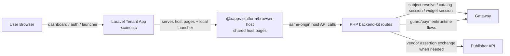
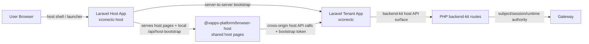

# Laravel Integration Map

Use this page when the tenant team wants the shortest explanation of the
Laravel integration shapes we support today.

This page is a map, not the full contract reference. Read these next for the
full details:

- shared tenant guide:
  - [../README.md](../README.md)
- backend contract:
  - [../backend/README.md](../backend/README.md)
- host contract:
  - [../host/README.md](../host/README.md)
- PHP/Laravel quickstart:
  - [php-laravel-quickstart.md](./php-laravel-quickstart.md)
- hosted-integrator runbook for the first real integrator shape:
  - [laravel-hosted-integrator-platform-tenant.md](./laravel-hosted-integrator-platform-tenant.md)

## Short Answer

Today we have three relevant PHP/Laravel-adjacent reference shapes:

| Shape                     | When to use it                                                                      | Reference                                                                   |
| ------------------------- | ----------------------------------------------------------------------------------- | --------------------------------------------------------------------------- |
| Thin PHP tenant backend   | You want the tenant backend contract on PHP with minimal local app concerns         | [xconectb](../../xconectb/backend/README.md)   |
| Laravel full tenant       | The tenant app itself owns auth, dashboard, business APIs, and marketplace surfaces | [xconectc](../../xconectc/README.md)           |
| Laravel hosted integrator | The integrator shell is separate and bootstraps into the tenant backend             | [xconectc-host](../../xconectc-host/README.md) |

All three still use the same shared contract:

- backend:
  - `xapps-platform/xapps-backend-kit`
- browser host:
  - `@xapps-platform/browser-host`
- recommended browser surface:
  - `bootstrapXappsEmbedSession(...)`
  - `mountCatalogEmbed(...)`
  - `mountSingleXappEmbed(...)`
- lower-level browser runtime, only when needed:
  - `@xapps-platform/embed-sdk`

## Recommended Decision Rule

Pick the shape based on who owns the visible application shell.

## Communication Shapes

### Full Laravel Tenant (`xconectc`)

Read it as:

- one Laravel app owns the tenant UX and the backend-kit surface
- the launcher can resolve identity locally first
- shared host pages still call the same app origin
- the app remains the gateway-facing authority

### Laravel Hosted Integrator (`xconectc-host`)

Read it as:

- the host shell is separate from the tenant backend
- the host app performs the trusted bootstrap call to the tenant app
- the browser only keeps the short-lived bootstrap token
- the tenant app still owns gateway/session/runtime authority

If your real-world shape is:

- existing Laravel app
- platform-hosted tenant backend
- one email may map to multiple business/member identities

read this immediately after this page:

- [laravel-hosted-integrator-platform-tenant.md](./laravel-hosted-integrator-platform-tenant.md)

### 1. Full Laravel Tenant App

Use this when the tenant app owns:

- auth and session UX
- dashboard and business pages
- local tenant APIs
- local marketplace launcher or host entry surfaces

Reference:

- [xconectc](../../xconectc/README.md)

In this shape:

- Laravel owns the tenant app shell
- the backend-kit host routes live alongside normal Laravel routes
- a same-origin launcher can resolve identity first and then hand off to shared
  host pages
- the shared browser host should still be used for `single-panel`,
  `split-panel`, and `single-xapp`

Use this when you want one tenant app, not a split frontend/backend product.

Key file anchors in the current reference:

- routes:
  - [apps/tenants/xconectc/routes/web.php](../../xconectc/routes/web.php)
    - Laravel route map for dashboard/auth/business pages, launcher pages, and
      kit-backed host endpoints
- backend-kit bootstrap:
  - [apps/tenants/xconectc/app/Support/Xapps/BackendKitBootstrap.php](../../xconectc/app/Support/Xapps/BackendKitBootstrap.php)
    - tenant-specific PHP backend-kit config, origins, payment defaults, guard
      ingest config, and bridge wiring
- kit dispatch bridge:
  - [apps/tenants/xconectc/app/Http/Controllers/XappsBackendKitController.php](../../xconectc/app/Http/Controllers/XappsBackendKitController.php)
    - forwards Laravel requests into the PHP backend-kit route surface
- local launcher and host-mode helper:
  - [apps/tenants/xconectc/app/Http/Controllers/HostProofController.php](../../xconectc/app/Http/Controllers/HostProofController.php)
    - same-origin launcher bootstrap, local host asset delivery, and starter config
- launcher page:
  - [apps/tenants/xconectc/resources/host-pages/index.html](../../xconectc/resources/host-pages/index.html)
    - workspace launcher UI for `single-panel`, `split-panel`, and
      `single-xapp`
- local thin host assets:
  - [apps/tenants/xconectc/resources/host/launcher.js](../../xconectc/resources/host/launcher.js)
  - [apps/tenants/xconectc/resources/host/marketplace.js](../../xconectc/resources/host/marketplace.js)
  - [apps/tenants/xconectc/resources/host/single-xapp.js](../../xconectc/resources/host/single-xapp.js)
    - local SDK consumer files that mount catalog and single-xapp surfaces with
      `ENTRY_HREF` configured back to `/catalog`

Browser SDK boundary:

- public browser SDK: `@xapps-platform/browser-host`
- repo reference host controllers for the secondary proof lanes still live under
  `apps/tenants/reference-host-common`

### 2. Laravel Hosted Integrator Shell

Use this when the visible host shell is separate from the tenant backend.

Reference:

- [xconectc-host](../../xconectc-host/README.md)

In this shape:

- the host/integrator app runs on its own origin
- it asks its own backend for a short-lived bootstrap result
- the tenant backend remains the authority for:
  - subject resolution
  - catalog/widget session minting
  - lifecycle routes
  - bridge routes
  - payment/runtime behavior

Use this when the integrator owns the shell but must not receive raw tenant or
gateway credentials in the browser.

Key file anchors in the current reference:

- local bootstrap/app routes:
  - [apps/tenants/xconectc-host/routes/web.php](../../xconectc-host/routes/web.php)
    - host-only Laravel routes and local `/api/host-bootstrap`
- local bootstrap controller:
  - [apps/tenants/xconectc-host/app/Http/Controllers/HostProofController.php](../../xconectc-host/app/Http/Controllers/HostProofController.php)
    - server-side bootstrap proxy into the paired tenant backend
- local config surface:
  - [apps/tenants/xconectc-host/.env.example](../../xconectc-host/.env.example)
    - public base URL, tenant backend URL, and bootstrap API key envs
- paired tenant backend:
  - [apps/tenants/xconectc/app/Support/Xapps/BackendKitBootstrap.php](../../xconectc/app/Support/Xapps/BackendKitBootstrap.php)
    - where the real host API authority still lives

### 3. Thin PHP Backend Reference

Use this when the question is simply:

- can the tenant backend contract be implemented on PHP?

Reference:

- [xconectb](../../xconectb/backend/README.md)

This is the lean adapter proof, not the full Laravel product-style app.

## What Stays The Same Across All Laravel Shapes

The same tenant backend contract still applies:

- `GET /api/host-config`
- `POST /api/resolve-subject`
- `POST /api/create-catalog-session`
- `POST /api/create-widget-session`
- `GET /api/installations`
- `POST /api/install`
- `POST /api/update`
- `POST /api/uninstall`
- optional hosted-integrator bootstrap:
  - `POST /api/host-bootstrap`

The same host runtime rule still applies:

- do not rebuild the browser runtime from scratch
- keep local code focused on:
  - branding
  - shell/layout
  - identity bootstrap
  - app-specific callbacks

Gateway interaction rule:

- browser code never talks to the gateway with raw tenant credentials
- the Laravel tenant app remains the gateway-facing authority in both shapes
- the hosted-integrator variant only changes where the outer shell and bootstrap
  call live

## Host Shape Matrix

| Host shape                       | Typical page owner      | Backend origin   | Key note                                                        |
| -------------------------------- | ----------------------- | ---------------- | --------------------------------------------------------------- |
| Same-origin host                 | tenant app              | same origin      | simplest standard host path                                     |
| Same-origin launcher-backed host | tenant app              | same origin      | launcher resolves identity, then hands off to shared host pages |
| Hosted-integrator host           | separate integrator app | different origin | set `backendBaseUrl` and backend `host.allowedOrigins`          |

Current references:

- same-origin host:
  - [xconect host](../../xconect/host/README.md)
  - [xconectb host](../../xconectb/host/README.md)
- same-origin launcher-backed host:
  - [xconectc](../../xconectc/README.md)
- hosted-integrator host:
  - [xconect-host](../../xconect-host/README.md)
  - [xconectb-host](../../xconectb-host/README.md)
  - [xconectc-host](../../xconectc-host/README.md)

## Config Rules That Usually Matter

### Full Laravel Tenant (`xconectc` style)

Usually important:

- `XAPPS_GATEWAY_URL`
- `XAPPS_API_KEY`
- `XCONECTC_ALLOWED_ORIGINS`
- `XCONECTC_HOST_BOOTSTRAP_API_KEYS`
- `XCONECTC_HOST_BOOTSTRAP_SIGNING_SECRET`
- `XCONECTC_GUARD_INGEST_API_KEY`
- payment return envs for the chosen lane

The code that consumes most of these values lives in:

- [apps/tenants/xconectc/app/Support/Xapps/BackendKitBootstrap.php](../../xconectc/app/Support/Xapps/BackendKitBootstrap.php)
- [apps/tenants/xconectc/app/Http/Controllers/HostProofController.php](../../xconectc/app/Http/Controllers/HostProofController.php)

### Laravel Hosted Integrator (`xconectc-host` style)

Usually important:

- `XCONECTC_HOST_PUBLIC_BASE_URL`
- `XCONECTC_HOST_BACKEND_BASE_URL`
- `XCONECTC_HOST_BOOTSTRAP_BACKEND_BASE_URL`
- `XCONECTC_HOST_BOOTSTRAP_API_KEY`

And on the paired tenant backend:

- `host.allowedOrigins` / tenant allowlist must include the host origin
- payment return allowlists must include the frontend host origin when needed

The code that consumes these values lives in:

- [apps/tenants/xconectc-host/app/Http/Controllers/HostProofController.php](../../xconectc-host/app/Http/Controllers/HostProofController.php)
- [apps/tenants/xconectc/app/Support/Xapps/BackendKitBootstrap.php](../../xconectc/app/Support/Xapps/BackendKitBootstrap.php)

## Practical Rule

Do not decide based on framework branding alone.

Choose based on ownership:

- if the tenant app owns the real product shell, use the full Laravel tenant
  shape
- if the integrator shell is separate, use the hosted-integrator shape
- if you only need a PHP proof of backend parity, use the thin PHP reference
