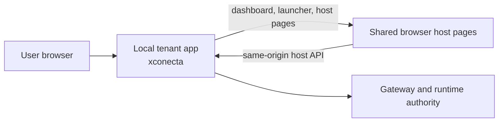

# xconecta (tenant workspace)

`xconecta` is the Node reference-driven tenant variant.

It is also the current tenant base used in the first `xconecta + xplace` production lane.

Use this when you want the same tenant contract with the reference-driven host-page
layer.

## What This Shape Looks Like



Read it as:

- the tenant app owns both the visible shell and the tenant backend contract
- host pages are reference-driven (via `reference-host-common`) while runtime
  and protocol behavior stay on the same tenant contract
- use this when backend ownership is intentional, not just because a host shell
  needs to go live quickly

Do not start here if the first delivery only needs a hosted-integrator shell with the tenant backend still platform-hosted. In that case, start from:

- [apps/tenants/docs/tooling/first-hosted-tenant-integrator-handoff.md](../docs/tooling/first-hosted-tenant-integrator-handoff.md)
- [apps/tenants/xconectc-host/README.md](../xconectc-host/README.md)
- [apps/tenants/docs/README.md](../docs/README.md)

## Read this first

- tenant implementation guide:
  - [docs/README.md](../docs/README.md)
- shared lane hub:
  - [docs/guides/xconecta-xplace/README.md](../../../docs/guides/xconecta-xplace/README.md)

Suggested reading order:

1. [docs/README.md](../docs/README.md)
2. [docs/backend/README.md](../docs/backend/README.md)
3. [docs/host/README.md](../docs/host/README.md)
4. [docs/guards/README.md](../docs/guards/README.md)
5. [docs/integrations/README.md](../docs/integrations/README.md)
6. [docs/modules/README.md](../docs/modules/README.md)
7. [docs/tooling/README.md](../docs/tooling/README.md)
8. [docs/publishing/README.md](../docs/publishing/README.md)
9. [docs/data-seams/README.md](../docs/data-seams/README.md)

## What lives here

- tenant backend reference:
  - [backend/README.md](./backend/README.md)
- tenant host reference:
  - [host/README.md](./host/README.md)
- tenant-owned xapps and guards:
  - [xapps/README.md](./xapps/README.md)

## Current role

This workspace exists to show, in code, what a tenant must implement independently of tech stack:

- the minimum backend seam
- the tenant host/embed seam
- tenant-owned guards and policy choices
- tenant-specific configuration and secrets
- reference-host-common host-page controller reuse

Current mode families documented here:

- host surfaces:
  - `single-panel`
  - `split-panel`
  - `single-xapp`
- payment ownership:
  - `gateway_managed`
  - `tenant_delegated`
  - `publisher_delegated`
  - `owner_managed`

It is intentionally still a lean reference, not a full tenant product shell.

Important boundary:

- `xconecta` is public-starter material
- `xconect` and `xconectc` are the standalone primary tenant implementations
- `xconecta` is the reference-driven variant of that same contract
- production-specific behavior should live in private deploy/runtime overlays around it
- do not fork a second private Node tenant codebase unless the code actually proves that need

Practical rule:

- copy the contract, not the Node file layout
- if the real tenant uses PHP, Go, or another stack, reproduce the same request/response seams and ownership boundaries
- treat this workspace as the reference implementation of the tenant contract, not as a mandatory runtime stack

Dependency rule:

- inside this canonical monorepo, `xconecta` currently uses local built-package wiring for coordinated development
- public starter/reference exports should prefer the published npm packages where they exist
- for those public exports, prefer the latest published stable versions by default

## Provisioning helpers

```bash
npm run seed:xconecta-tenant
npm run seed:xconecta-tenant-admin
npm run seed:xconecta-policy-publisher
```

Workspace-owned wrapper entrypoints now live under:

- [scripts/provision-tenant.mjs](./scripts/provision-tenant.mjs)
- [scripts/provision-tenant-admin.mjs](./scripts/provision-tenant-admin.mjs)
- [scripts/provision-policy-publisher.mjs](./scripts/provision-policy-publisher.mjs)

Those wrappers delegate to the shared root implementations in [scripts](../../../scripts), while keeping the tenant-owned operational entrypoints inside the `xconecta` workspace.
