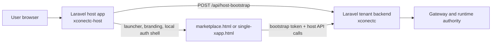

### XconectC Host (Laravel 12 Hosted Integrator Reference)

`xconectc-host` is the active Laravel hosted-integrator starter/reference app.

It is intentionally minimal. It demonstrates the hosted-integrator/session contract, not a
required product shell. Real integrators can keep their own authenticated Laravel app and
mount the same launcher, marketplace, single-xapp, bootstrap proxy, and bridge/session
routes inside that fuller application.

It is the Laravel counterpart to:

- [`integration-host`](../../../samples/tenants/integration-host/README.md) for the Node host path
- [`xconectc`](../xconectc/README.md) for the paired Laravel full-tenant path
- [`x-api`](../../../samples/tenants/x-api/README.md) for the Node tenant/backend path
- [`publisher-api`](../../../samples/publishers/publisher-api/README.md) for the sample publisher/executor lane

It keeps the host/integrator shell local, while the actual tenant-side xapps host APIs stay on `xconectc`.

## What This Shape Looks Like



Read it as:

- the Laravel host app owns the visible shell and local bootstrap proxy
- the paired tenant backend still owns subject resolution, catalog/widget
  sessions, bridge routes, and payment/runtime authority
- the browser only carries a short-lived bootstrap token, not raw backend
  credentials

Use this when:

- the integrator already has a Laravel platform/app shell
- fast delivery matters more than full tenant-backend ownership
- the tenant backend should stay platform-hosted while the browser shell stays local

Do not treat this README as the only contract source. Read these first as the shared docs:

- [apps/tenants/docs/README.md](../docs/README.md)
- [apps/tenants/docs/host/README.md](../docs/host/README.md)
- [apps/tenants/docs/tooling/laravel-integration-map.md](../docs/tooling/laravel-integration-map.md)

## First Reading Order

1. [apps/tenants/docs/README.md](../docs/README.md)
2. [apps/tenants/docs/host/README.md](../docs/host/README.md)
3. [apps/tenants/docs/tooling/laravel-integration-map.md](../docs/tooling/laravel-integration-map.md)
4. this README for the concrete Laravel proof lane

It provides:

- A simple HTML dashboard:
    - `GET /dashboard`
- Hosted-integrator proof pages:
    - `GET /`
    - `GET /marketplace.html`
    - `GET /single-xapp.html`
- Local bootstrap proxy:
    - `POST /api/host-bootstrap`
- Host assets and SDK delivery:
    - `GET /host/proof-config.js`
    - `GET /host/*`
    - `GET /embed/sdk/xapps-embed-sdk.esm.js`
- Health:
    - `GET /health`

It intentionally does not provide:

- tenant/member auth flows
- a full operator domain model
- integrator-specific navigation, RBAC, or business pages

#### Local run

```bash
cd apps/tenants/xconectc-host

# Install deps
composer install

# Generate app key
php artisan key:generate

# SQLite db (path matches .env / deploy compose)
mkdir -p database
touch database/database.sqlite

# Migrate + seed demo data
php artisan migrate:fresh --seed

# Serve
PHP_CLI_SERVER_WORKERS=4 php artisan serve --host=127.0.0.1 --port=8002
```

Then open:

- `http://127.0.0.1:8002/dashboard`
- `http://127.0.0.1:8002/`
- `http://127.0.0.1:8002/marketplace.html`

#### Notes

- Keep `PHP_CLI_SERVER_WORKERS` greater than `1` for local hosted-widget testing. The paired tenant
  backend can receive gateway callbacks while the host request is still waiting for the gateway
  result.

- In the `partners-examples` deploy lane, the container startup now creates:
    - `database/database.sqlite`
    - the initial Laravel schema + seed data

- Required env for the host proof:
    - `XAPPS_API_KEY` should match the paired `xconectc` tenant key
    - `XCONECTC_HOST_PUBLIC_BASE_URL`
    - `XCONECTC_HOST_BACKEND_BASE_URL`
    - `XCONECTC_HOST_BOOTSTRAP_BACKEND_BASE_URL`
    - `XCONECTC_HOST_BOOTSTRAP_API_KEY`

- Current package status:
    - `xconectc-host` is the Laravel host-only starter/reference app, mirroring the `xconectb-host` lane.
    - `xconectc` remains the paired Laravel full tenant/backend starter/reference app.
    - inside the canonical monorepo it may keep Composer `path` repositories for local development.
    - in the public starter/reference export, prefer Packagist package `xapps-platform/xapps-php` instead of local path repos.
