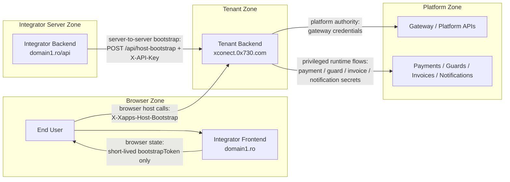
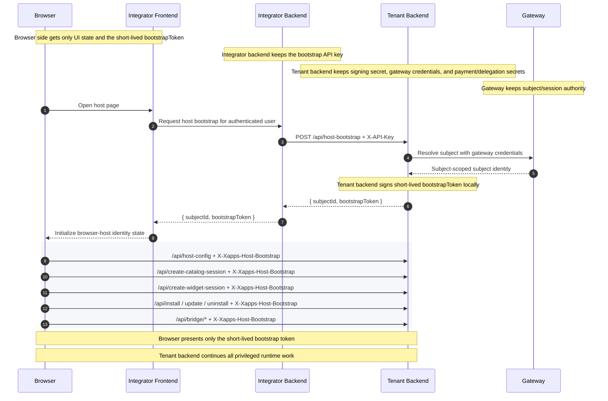

# Hosted Integrator Flow

This page shows the secure hosted-integrator model visually.

Goal:

- integrator owns the frontend UX on their own domain
- integrator backend performs the trusted bootstrap call
- tenant backend remains the platform backend of record
- tenant backend signs the browser bootstrap token
- browser never receives a raw platform API key

## Component View

## Bootstrap Sequence

## Trust Boundary

What stays server-side:

- raw platform API key
- subject resolution authority
- bootstrap token signing
- catalog/widget session minting
- bridge refresh/signing
- payment orchestration
- guard, invoice, and notification flows

What reaches the browser:

- short-lived `bootstrapToken`
- subject-scoped host/session responses
- normal embed/browser runtime state

Credential/auth rule:

- integrator backend -> tenant backend: server-side bootstrap API key
- browser -> tenant backend: short-lived bootstrap token
- tenant backend -> gateway/platform services: normal platform credentials/secrets

The model is secure because:

- the browser does not receive raw tenant/gateway credentials
- the browser only receives a short-lived tenant-backend-issued bootstrap token
- the privileged system-to-system calls stay server-side
- the tenant backend remains the authority that mints browser-admission state for its own host APIs

## Secret And Credential Ownership

### Browser / Integrator Frontend

What it may hold:

- short-lived `bootstrapToken`
- normal browser host/runtime state

What it must not hold:

- tenant backend bootstrap API keys
- tenant backend signing secrets
- gateway API keys
- publisher API keys
- delegated payment secrets

### Integrator Backend

What it may hold:

- integrator-side authenticated user/session state
- server-side bootstrap API key used to call `POST /api/host-bootstrap`

What it must not expose to browser code:

- bootstrap API key
- tenant/gateway API keys
- other privileged platform credentials

### Tenant Backend

What it holds:

- `host.bootstrap.apiKeys`
- `host.bootstrap.signingSecret`
- gateway client credentials / API key
- delegated payment secret refs where relevant
- owner-managed payment signing/return secrets where relevant

What it does with them:

- authenticates the integrator backend bootstrap call
- resolves subject through the gateway
- signs the short-lived browser bootstrap token
- mints catalog/widget sessions
- runs bridge, lifecycle, payment, guard, invoice, and notification flows

### Gateway / Platform Side

What it holds:

- platform/gateway credentials
- subject resolution authority
- session minting authority
- platform-owned payment/invoice/notification credentials and state

Current bootstrap note:

- the gateway participates in subject resolution during bootstrap
- the gateway does not issue the browser bootstrap token in the current design

Operational note:

- the browser host should treat the bootstrap token as time-bounded session state
- after expiry, the frontend should re-run bootstrap instead of trying to continue with stale subject identity

## Current Config Surface

Integrator/frontend side:

- `backendBaseUrl`
- local host pages/assets
- local identity bootstrap storage

Integrator backend side:

- server-side bootstrap API key
- authenticated user context
- call to `POST /api/host-bootstrap`

Tenant backend side:

- `host.allowedOrigins`
- `host.bootstrap.apiKeys`
- `host.bootstrap.signingSecret`
- optional `host.bootstrap.ttlSeconds`

Gateway side during bootstrap:

- resolves subject identity
- does not issue the browser bootstrap token in the current design

## Current Local Proof

- [xconect-host](../../apps/tenants/xconect-host/README.md)
- [xconectb-host](../../apps/tenants/xconectb-host/README.md)
- related same-origin launcher-backed tenant sample:
  - [apps/tenants/xconectc/README.md](../../apps/tenants/xconectc/README.md)
- [backend-kit docs](./backend-kit.md)
- [browser-host docs](./browser-host.md)

The local proof hosts are intentionally minimal. They demonstrate the browser
contract and cross-origin tenant backend handoff, but they do not replace a
real integrator backend that authenticates the user before requesting host
bootstrap.
